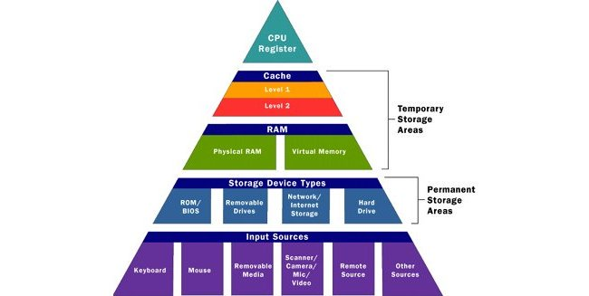
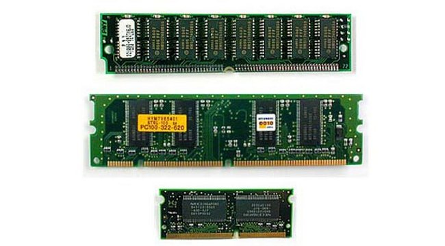
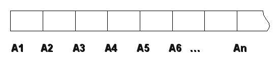
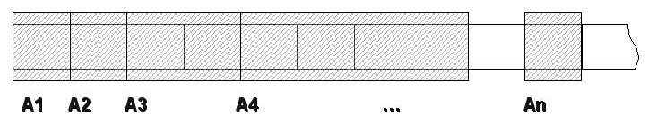
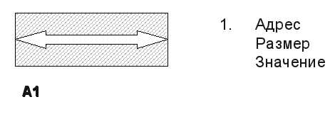

##  Тема 1. Память

### Иерархия памяти

Память является ключевым понятием для программирования. В ЭВМ существует *иерархия видов памяти*, образующая своеобразную пирамиду:


Рисунок 1. Иерархия памяти

Верхний уроверь занимает **регистровая память**. Далее располагаются многоуровневые **кэши**. Ниже есть слой **ОЗУ**, который представляет собой основной рабочий тип памяти. Далее идут слои, относящиеся к **внешней памяти**.

В этой "пирамиде" по мере движения от верхних уровней к нижним, размер памяти *возрастает*, а быстрота доступа и стоимость условного бита *падают*. Таким образом, наиболее быстрой является *регистровая память*, а наиболее медленной - *внешняя*.

Кроме того, вся память, кроме внешней - энергозависима и ее содержимое пропадает, после выключения питания.

### Виртуальная и физическая память

Память в операционной системе может быть представлена как **физическая** и **виртуальная**. Первому виду памяти соответствует реальное аппаратное обеспечение (набор микросхем, устройства), а второму - не соответствует. Виртуальная память выделяется каждому запущенному на выполнение процессу в виде фиксированного блока, размер которого определяется разрядностью ОС. Например, в 32-битной системе размер виртуального адресного пространства процесса равен 4ГБт.



Фактически программа использует только виртуальную память, а ее отображение на физическую осуществляет ОС. 


### Структура виртуальной памяти процесса

Содержание этого вопроса зависит от операционной системы, от используемых в ней соглашений по распределению памяти. Рассмотрим в качестве примера структуру памяти для процесса в linux:


В этой памяти можно выделить следующие подобласти:

- **стек**
- **куча**
- **сегменты статических данных (и кода) процесса**

Все эти области имеют важное значение для программы, поскольку все данные размещаются в них, в соответствии с **классами хранения**.

### Простейшая модель памяти для программы

Для программы, в не зависимости, какая область памяти использована, простейшее представление выглядит следующим образом:



Память делится на ячейки одинакового размера (1Бт, 8 двочиных разрядов или бит). Местоположение каждой ячейки определяется **адресом**, то есть порядковым номером.

Каждая ячейка может иметь 2^8 (256) вариантов состояния, что является недостаточным для реальной жизни, поэтому ячейки объединяются вместе, образуя виртуальные ячейки произвольного размера (обычно кратные 2), имеющие больше состояний.



Таким образом, минимальной единицей памяти выступает ячейка, у которой есть **адрес**, **размер** и некоторое **значение**, зависящее от соглашений по поводу **типа**, то есть трактовки состояния ячейки.



Узнать адрес, размер и значение ячейки можно с помощью специальных операций, как показано в следующей программе:


```c++
#include <iostream>
using namespace std;
int main()
{
   int a;
   cout<<&a<<" "<<sizeof(a)<<" "<<a<<endl;
   return 0;
}
```

### Классы хранения

**Класс хранения** определяет, в какой области памяти будет размещена переменная, откуда в программе к ней может осуществляться доступ и сколько переменная будет жить по времени.

Для переменных, объявленных в фигурных скобок без ключевого слова **static** используется **автоматический** класс хранения:

```c++
int main()
{
   int a;
}
```

Эти переменные получают адрес в стековой памяти в мемент входа в блок (пару скобок) и живут до тех пор, пока управление не выйдет за фигурные скобки.

Значение неинициализированной переменной не определено.

При использовании внутри фигурных скобок слова **static** память под переменную выделяется в статической области.

```c++
int main()
{
   static int a;
}
```

Переменная живет в течении всего времени выполнения программы и инициализируется нулем.

Имеется возможность попросить компилятор по возможности связать переменную с регистром процессора для ускорения работы с ней. Для этой цели предусмотрено ключевое слово **register**. Но в этом случае на переменнную накладывается ряд дополнительных условий: например, она по размеру не может быть больше чем регистр, не производится операций с ее адресом.

#### Упражнение:

>Написать программу, в которой объявлены переменные с автоматическим  и статическим классом хранения, а затем сравнить их адреса и значения.

