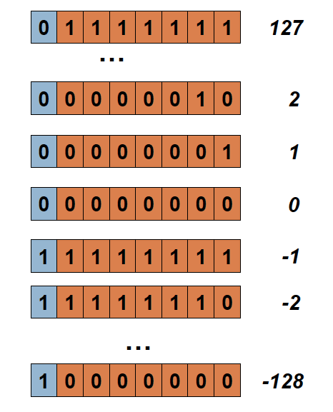
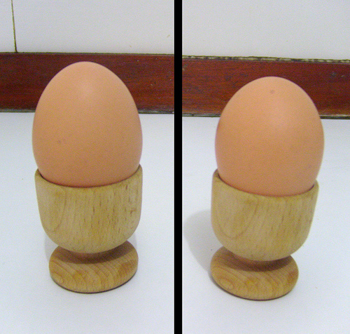
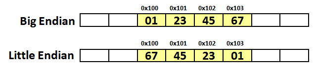
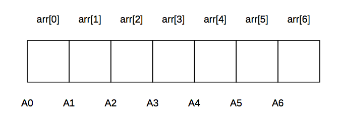

## Тема 2. Типы, выражения, функции

### Объявления и инициализация переменных

Классическое выражение для объявления переменной в стандарте С++98:

```c++
int a=10;
```

также разрешается инициализация с круглыми скобками:

```c++
int a(10);
```

В стандарте С++11 разрешены и другие формы:

```c++
int a={10};
int a{10};
```

В новом стандарте можно использовать ключевое слово `auto` для объявления и инициализации переменных:

```c++
auto a=10;
auto a={10};
auto a(10);
auto a{10};
```

Использование фигурных скобок может вызывать вопрос о целесообразности нового синтаксиса. На самом деле, в этом случае задействуется  `std::initializer_list<int>` из стандартной библиотеки, который обладает дополнительными проверками данных на корректность, что может оказаться полезным.


Рассмотрим пример:

```c++
void fun(double val, int val2) {

    int x2 = val; // если val==7.9, x2 становится 7 (плохо)
    char c2 = val2; // если val2==1025, c2 становится 1 (плохо)
    int x3 {val}; // ошибка: потеря данных (ок)
    char c3 {val2}; // ошибка: сужение (ок)
    char c4 {24}; // OK: 24 может быть char (ок)
    char c5 {264}; // ошибка : 264 не может быть char (ок)
    int x4 {2.0}; // ошибка:  double to int  (ОК)

}
```

Одно из важнейших преимуществ объявления переменных с помощью `auto` - необходимость их явной инициализации. Без указания значения объявить переменную не получиться.

Можно явно узнать тип переменной:

```c++
auto a=10.;
cout<<typeid(a).name()<<endl;
```

Ответом будет строка `d`, означающая тип `double`.

#### Упражнение:

>Написать программу, в которой объявлены переменные с ключевым словом `auto` и используются константы разных типов. Проверить типы с помощью `typeid`.

### decltype

Еще одним новвоведением современных стандартов стала конструкция **decltype**. С помощью нее можно объявить переменную такого же типа:

```c++
auto a{10};
decltype (a) b;
```

В скобках после decltype можно использовать выражение, тип результата которого и будет использован для задания типа переменной.

### Типы данных

Когда мы создаем в программе объект, требующий памяти, то мы относим его к определенному типу. Тип задает соглашения о интерпретации значений разрядов в ячейке памяти.

Напимер, беззнаковое целое **unsigned** трактует все разряды как значение целого числа, а знаковое **signed** выделяет старший разряд как знаковый и в зависимости от его значение трактует как число с минусом или плюсом.

При попытке присвоения значения "длинной" переменной более "короткой" происходит отбрасывание лишних байтов, что вызывает потерю информации. При обратном действии, возникают лишние байты с нулевыми значениями.

Что происходит при переполнении значения ячейки? Ничего, поскольку для чисел со знаком мы переходим из положительной области значений в отрицательную, а потом наоборот.



Значения меняются по кругу.

Особенностью представления вещественных чисел является приблизительная точность.

```c++
#include <iostream>
using namespace std;
int main()
{
    float a=3.3;
    cout.setf(ios::showpoint);
    cout.precision(10);
    cout<<a<<endl;
    return 0;
}
```
Ответ:

 ```
 3.299999952
 ```


### Big endian и little endian



Используется два порядка расположения байтов в многобайтной величине:  от старшего к младшему **big endian** и от младшего к старшему **little endian**.




- **BE** используют: IBM 360/370/390, Motorola 68000, SPARC 
- **LE** используют: Intel x86


Существенным достоинством little-endian по сравнению с big-endian порядком записи считается возможность ''неявной типизации'' целых чисел при чтении меньшего объёма байт.

Так, если в ячейке памяти содержится число 0x00000022, то прочитав его как int16 (два байта) мы получим число 0x0022, прочитав один байт — число 0x22. Однако, это же может считаться и недостатком, потому что провоцирует ошибки потери данных.

Как проверить систему?

```c++
int endian1() {
  int one = 1;
  char *ptr;
  ptr = (char *)&one;
  return (*ptr);
}
int endian2() {
  union {
    int one;
    char ch;
  } endn;
  endn.one = 1;
  return endn.ch;
}
```

### Объявление и иницализация массивов

Массив представляет собой набор данных одного типа, расположенных в смежных ячейках памяти.

```c++
int arr[7];
```



Квадратные скобки являются признаком массива, а число в этих скобках - количество элементов, размещенных в массиве. 

Существуют также **variable length array (VLA)**, которые поддерживаются поздними стандартами языка С. Однако, при использовании **gcc(g++)** в С++ тоже можно использовать VLA (на свой страх и риск).


```c++
#include <iostream>
using namespace std;

int main()
{
    int size;
    cin>>size;
    int arr[size];
    cout<<sizeof(arr)<<endl;
    return 0;
}
```

VLA можно создавать только внутри фигурных скобок.

Адрес любого элемента массива может быть легко найден, если известен адрес первой ячейки (А0).

- A0=&arr[0]=arr
- A1=A0+1*sizeof(int)  
- A2=A0+2*sizeof(int)
- An=A0+n*sizeof(int)

Обращение к *i*-му элементу записывается в виде выражения `arr[i]`.

Следующая программа демонстрирует создание, инициализацию и обработку массива с позиций стандарта **C++11**:

```c++
#include <iostream>
using namespace std;

int main()
{
    int arr[]{1,2,3};
    for(auto item:arr) 
        cout<<item<<" ";
    cout<<endl;
    return 0;
}
```

###  Указатели

**Указатели** - это ячейки памяти, хранящие адреса других ячеек памяти. В этом случае говорят, что указатель ссылается или указывает на какую-то переменную.

Можно создать указатель на:

- обычную переменную;
- указатель;
- массив;
- функцию.

Примеры различных указателей:

```c++
int a=10;
int b[5][15]{};

int *pa=&a;       // указатель на int
int (*pb)[15]=b;  // указатель на массив из 5 int
int **pc=&pa;     // указатель на указатель на int
```

Главная операция при работе с указателями - **разыменование**, то есть обращение в память по адресу, хранящемуся в указателе.

Над адресами выполняются операции **адресной арифметики**: 

- сложние адреса с целым числом
- вычитание из адреса целого числа
- вычитание из адреса адреса

Особое положение занимает **обобщенный** указатель, или указатель на тип void. Его особенность в том, что он может сохранить адрес объекта любого типа, но к нему нельзя применить разыменование или операции адресной арифметики.

В качестве примера использования обобщенного указателя можно привести создание компараторов для сравнения элементов массива при сортировке или бинарном поиске:

```c++
int comp( const void* a, const void* b ) {
    return ( *( int* )a - *( int* )b );
}

int main() {
    int arr[LARGE_SIZE];
    // генерируем случайные данные
    generate(arr, arr + LARGE_SIZE, rnd() );
    // выполняем сортировку, используя функцию qsort
    qsort(arr, LARGE_SIZE, sizeof( int ), comp );
    ...
}
```

### Функции

Функции являются относительно самостоятельной частью программы, которую можно выполнять множество раз, задавая значения некоторых параметров. Обычно у функции есть **заголовок** и **тело**.

Пример простейшей функции:

```c++
int add(int x,int y)
{
   return x+y;
}
```

Работа функций осуществляется через стек. При вызове функции формируется **stack frame**, в котором размещаются формальные параметры, в которые копируются входные значения (фактические параметры), локальные переменные, после чего осуществляется переход управления на тело функции. После окончания работы из стека извлекаются результат работы функции (выражение в строке с **return**) и управление снова передается в точку вызова. Весь этот механизм требует определенного времени и расходует память на копирование объектов. Поэтому стараются снизить нагрузуку на функции, передавая адреса объектов, а не их копии (что имеет смысл для больших объектов).

Передача в качестве параметров в функции адресов объектов позволяет в некоторых случаях увеличить производительность программы, но в ряди других случаев создает серьезную угрозу стабильности работы программы. Получив адрес, функция может обратиться по нему и изменить данные, которые были сформированы в другой точке программы. Это создает проблемы для поиска ошибок, а в случае, когда при передачи адреса возникла ошибка, может привести к сбоям в работе всей программы. Поэтому, обычные функции, принимающие копии входных данных и возвращающие копии результатов, гораздо более безопаснее и лучше тестируются.

### Указатели на функции

Для создания указателя на функцию необходимо воспроизвести сигнатуру функции (кроме имени), например

```c++
int fun(const char *str)
{...}

int (*pf)(const char*)=fun;
...
cout<<fun("***");
cout<<pf("***");
...
```

Основное назначение указателей на функции: обеспечение передачи ссылки на функцию на вход другой функции. Появляется возможность создавать функции, вызывающие другие через параметры. Это очень важная часть **функционального подхода** к программированию.

```c++
void map(int *arr, int size, int (*f)(int))
{
   for(int i=0;i<size;i++)
      arr[i]=f(arr[i]);
}
int square(int x)
{
   return x*x;
}
int doubl(int x)
{
   return 2*x;
}
int main()
{
   int arr[]{1,2,3,4,5};
   map(arr,5,square);
   map(arr,5,doubl);
   return 0;
}
```

#### Упражнение:

>Рассмотреть обобщенную функцию сортировки из страндартной библиотеки C++


### Категория выражения: lvalue и rvalue

Когда мы пишем некоторое выражение мы вправе задасться вопросом: какой тип у результата? Но помимо типа рассматривается еще и категория: **lvalue** или **rvalue**. 

В языке С различия между этими категориями просты:

- если выражение может стоять слева от присваивания, то оно **lvalue**.
- все остальные относятся к **rvalue**.


### Ссылки lvalue

Традиционные ссылки С++ называют теперь **lvalue-ссылками** из-за появления **rvalue-ссылок**.

Ссылочный тип данных упрощает синтаксически программу, где используется много указателей.

Вот так выглядит "классическая" функция обмена значений переменных:

```c++
void swap(int *a,int *b)
{
   int t=*a;
   *a=*b;
   *b=t;
}
```

А вот так записывается версия с *lvalue* ссылками:

```c++
void swap(int &a,int &b)
{
   int t=a;
   a=b;
   b=t;
}
```

**lvalue** ссылки могут быть привязаны к обычным переменным. Но их нельзя привязать к временным объектам, которые создаются в памяти при копировании. Для работы с такими объектами были придуманы **rvalue**-ссылки.

### Ссылки rvalue

В стандарте **С++11** былл введен новый тип ссылок: **rvalue**, которые объявляются с двумя амперсандами.

```c++
#include <iostream>
using namespace std;

int fun()
{
    return 22;
}
int main()
{
    int a=33;
    int&& b=fun();
    cout<<b<<endl;    
    b=a;
    cout<<b<<endl;
    a=44;
    cout<<b<<endl;
    
    return 0;
}
```
При изменении `a` значение `b` не меняется, поскольку временная ячейка памяти не изменилась.

При попытке связать rvalue-ссылку с обычной переменной компилятор g++ выдает сообщение об ошибке:

```c++
#include <iostream>
using namespace std;

int main()
{
    int a=33;
    int&& b=a;
    cout<<b<<endl;   
    return 0;
}
```
```

$ g++ -std=c++11 ref2.cpp
ref2.cpp:7:11: error: rvalue reference to type 'int' cannot bind to
     lvalue of type 'int'
    int&& b=a;
          ^ ~
1 error generated.
```

### Семантика перемещения

Для чего используются **rvalue** - ссылки?

Ответ и прост и сложен. При работе с объектами стандартных типов, этот механизм почти бесполезен. Но давайте рассмотрим функцию **swap** для больших и сложных объектов (например, векторов)

```c++
void swap(vector<int>& a, vector<int>& b)
{
   vector<int> tmp(a); // сейчас мы имеем две копии объекта a
   a = b;    // теперь у нас есть две копии объекта b
   b = tmp;  // а теперь у нас две копии объекта tmp (т.е. a)
}
```
Использование радиционных ссылок приводит к созданию лишних копий в момент объявления временной переменной. Если использовать **rvalue** ссылки, но копирования удается избежать:

```c++
void swap(vector<int>& a, vector<int>& b)
{
    vector<int> tmp(std::move(a));
    a = std::move(b);
    b = std::move(tmp);
}
```

В этом примере **tmp** получает **rvalue** ссылку на объект а.  Аналогично это происходит и в других строках. В таких случаях не гарантируется сохранность исходного объекта, он просто передает свои данные другому объекту.

**Перемещение** – это считывание со стиранием (destructive read).


