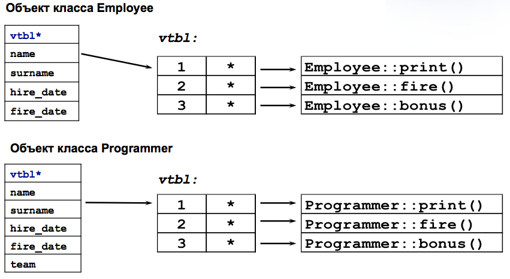

## Наследование

### Понятие наследования

При большом количестве никак не связанных классов в программе, управлять ими становится практически невозможным (так же, как и большим количеством функций в большом проекте). Наследование позволяет справиться с этой проблемой путем упорядочивания и ранжирования классов, то есть объединения общих для нескольких классов свойств в одном классе и использования его в качестве базового.

**Наследование** - механизм передачи свойств одних классов другим классам в процессе проектирования иерархии классов. Исходные классы называют **базовыми(БК) (родителями)**, вторые - **производными (ПК) (потомками)**.

Наследование может быть **одиночным** и **множественным**, в зависимости от числа непосредственных родителей у конкретного класса.

Классы, находящиеся ближе к началу иерархии, объединяют в себе наиболее общие черты для всех нижележащих классов. По мере продвижения вниз по иерархии классы приобретают все больше конкретных черт. Множественное наследование позволяет одному классу обладать свойствами двух и более родительских классов.


## Дерево наследования

Для удобного изображения отношений классов при наследовании строят специальный граф: **дерево наследования**:


Рисунок 1. Дерево наследования

Базовые классы изображают над производными.


### Пример с наследованием

```cpp
class Box    // тип ``коробка``
{
  protected:
    int width,height;
  public:
    void SetWidth(int w)  { 
       width=w;  
    }
    void SetHeight(int h) { 
       height=h; 
    }
};
class ColoredBox : public Box  // ``цветная коробка``
{
   int color;
 public:
   void SetColor(int c)  { 
      color=c; 
   }
};
```

### Ключи наследования

При описании производного класса в его заголовке перечисляются все базовые для него классы. Доступ к элементам этих классов регулируется с помощью ключей доступа: `private`, `protected` и `public`. Если базовых классов несколько, они перечисляются через запятую.

Использование ключей доступа вместе с разделами внутри БК позволяет сформировать правило, по которому будет осуществляться доступ к членам ПК.


|  Ключ доступа     | Раздел БК | Раздел ПК |
|-------------------|-----------|-----------|
| private           | private   | нет       |
| private           | protected | private   |
| private           | public    | private   |
| protected         | private   | нет       |
| protected         | protected | protected |
| protected         | public    | protected |
| public            | private   | нет       |
| public            | protected | protected |
| public            | public    | public    |


Из таблицы следует, что если, например, в БК некоторая переменная располагалась в разделе public, а ПК был объявлен с ключом private, то в ПК к данной переменной можно будет обращаться только членам ПК или его друзьям (эта переменная перейдет в раздел private ПК).
Когда происходит наследование без явного указания спецификатора, все имена базового класса в производном классе автоматически становятся приватными (или можно указать private).

Если наследовать с ключевым словом public - все общедоступные имена базового класса будут общедоступными в производном классе и все защищенные имена будут защищенными в производном классе.

## Правила наследования

Нельзя наследовать

- конструкторы
- деструкторы
- перегруженные new
- перегруженные =
- отношения дружественности

Правила для специальных методов

- Поскольку конструкторы не наследуются, ПК должен иметь собственные конструкторы.
- Если в конструкторе производного класса явный вызов конструктора базового класса отсутствует, автоматически вызывается конструктор БК.
- Для иерархии, состоящей из нескольких классов, конструкторы БК вызываются начиная с самого верхнего уровня. После этого выполняются конструкторы элементов класса, являющихся объектами, а затем - конструктор класса.
- В случае нескольких БК их конструкторы вызываются в порядке объявления.
- Для деструкторов эти правила справедливы, но порядок вызова обратный - сначала ПК, затем БК. Не требуется явно вызывать деструкторы, поскольку они будут вызваны автоматически.

## Передача параметра в конструктор БК

Данная ситуация возникает в том случае, когда конструктор БК должен быть вызван с параметром (параметрами). При записи конструктора ПК необходимо указать через двоеточие имя конструктора БК со списком фактических параметров.

```cpp
 class X   {
   int a,b,c;
  public:
   X(int x,int y,int z) { a=x; b=y; c=z; }
};
class Y : public Х  {
   int val;
  public:
   Y(int d) : X(d,d+1,d+5) { val=d; }
   Y (int d, int e);
}
Y::Y(int d, int e) : X(d,e,12)  {
   val=d+e;
}
```

## Работа с производными классами

Рассмотрим класс `Работник`, который содержит персональные данные, а также дату принятия на работу и увольнения

```cpp
struct Date {
  int dd,mm,yy;
};

class Employee {
private:
  string name, surname;
  Date hire_date, fire_date;
public:
  Employee(string _name,
           string _surname);
  ~Employee();
  void hire(Date d);
  void fire(Date d);
  string name() const;
  string surname() const;
  void print() const;
};
```
На основе этого класса создадим `Программиста`

```cpp
class Programmer: public Employee
{
private:
  string team;
public:
  Programmer(string _name,
             string _surname,
             string _team);
  ~Programmer();
  void set_team (string _team);
  string team() const;
  void print() const;
};
```

В результате у нас получается следующий набор методов

```cpp
Employee::Employee()
Employee::~Employee()
Employee::hire()
Employee::fire()
Employee::name()
Employee::surname()
Employee::print()

Programmer::Programmer()
Programmer::~Programmer()
Programmer::set_team()
Programmer::team()
Programmer::print()

Programmer::Employee::hire()
Programmer::Employee::fire()
Programmer::Employee::name()
Programmer::Employee::surname()
Programmer::Employee::print()
```

Проанализируйте результаты выполнения следующего кода:

```cpp
Date start_date(1,1,2004), end_date(31,12,2007);

Employee emp("Vasya", "Pupkin");
emp.hire(start_date);
cout << emp.name();
cout << emp.surname();
emp.print()
emp.fire(end_date);

Programmer prog("Petr", "Petrov", "GM00");
prog.hire(start_date);
prog.set_team("GM12");
cout << prog.name();
cout << prog.surname();
cout << prog.team();
prog.print();
prog.Employee::print()
prog.fire(end_date);
```

### Производные классы и указатели

```cpp
Programmer *prog1 = new Programmer("Petr", "Petrov", "GM12");
Employee *emp1 = prog1;   // хорошо
Employee *emp2 = new Employee("vasya", "Pupkin");
Programmer *prog2 = emp2; // ошибка 
prog2->set_team("GM00");  // нет team

void test_function(Employee& emp);

Programmer prog3("Ivan", "Ivanov", "GM00");
test_function (prog3);  // хорошо
```

С объектом производного класса можно обращаться как с объектом базового класса при обращении к нему при помощи указателей и ссылок.

### Функции-члены


```cpp
class Employee {
  string name, surname;
  //...
public:
 void print() const;
 string surname() const;
};

class Programmer: public Employee { //...
public:
 void print() const;
 //...
};

void Programmer::print() const
{
  cout << surname() << endl;
}
void Programmer::print() const
{
  cout << surname << endl;
}
void Programmer::print() const
{
  Employee::print();
  cout << team << endl;
}

int main()
{
  Employee emp("Vasya", "Ivanov");
  Programmer prog("Petr", "Petrov", "GM12");
 
  emp.print(); // Vasya Ivanov
  emp.surname(); // Ivanov
 
  prog.print(); // Petr Petrov GM12
  prog.surname(); // Petrov
}

```

### Копирование

```cpp
class Employee {
  //...
  Employee(const Employee&);
  Employee& operator=(const Employee&)
};

void f(const Programmer& rPrg)
{
   Employee emp = rPrg;
   emp = rPrg;
};
```
Копируется только Employee-часть Programmer – срезка.

```cpp
class Employee {
  string name, surname;
public:
  Employee(const Employee&);
  Employee& operator=(const Employee&)
  //...
};
class Programmer: public Employee {
  string team;
public:
   Programmer(const Programmer &);
   Programmer& operator=(const Programmer &)
  //...
};
Programmer::Programmer (const Programmer& rp)
  : Employee(rp), team(rp.team)
{
}

Programmer& Programmer::operator=(const Programmer &rp)
{
  Employee::operator=(rp);
  team = rp.team;
}
```

### Иерархия классов

Рассмотрим небольшую иерархию должностей в софтверной компании:


Рисунок 2. Иерархия должностей

```cpp
class Employee {/*...*/};
class Programmer: public Employee
{/*...*/};
class Team_leader: public Programmer
{/*...*/};
class Proj_manager: public Employee
{/*...*/};
class Senior_Manager: public Proj_manager
{/*...*/};
class HR_manager: public Employee
{/*...*/};


class Team_leader: public Programmer {
public:
  Team_leader(string n, string fn, string t);
  bool add_designer(Programmer*);
  bool rm_designer(string fn, string n);
  Programmer* get_designer(string fn, string n) const;
private:
  list<Programmer*> team_list;
};

Team_leader::Team_leader(string n,string fn, string t) :
                Programmer(n, fn, t),team_list()
{}
...
Team_leader tm("Igor", "Kotov", "GM12");
tm.hire(Date(20,3,2008));
cout << tm.name();
tm.set_team("GM18");
tm.add_designer(p);
tm.fire(Date());
```

## Виртуальные функции

```cpp
class Employee {
public:
  Worker(string _name,
         string _surname);

  // ...
  virtual void print() const;

private:
  string name, surname;
  Date hire_date, fire_date;
};

class Programmer: 
             public Employee
{
public:
  Programmer(string _name,
             string _surname,
             string _team);

  virtual void print() const;

private:
  string team;
};

void Employee::print() const
{
 cout << first_name << " " << surname    << endl;
}

void Programmer::print() const
{
  Employee::print();
  cout << "team: " << team << endl;
}

void print_emp(const Employee* pEmp)
{
  cout << "Employee info:" << endl;
  pEmp->print();
}

int main()
{
  Employee emp("Vassya", "Pupkin");
  Programmer prog("Ivan", "Sidorov", "GM12");
  print_emp ( &emp );
  print_emp ( &prog );
  return 0;
}

```



Рисунок 3. таблица виртуальных функций


Любой класс, который использует виртуальные функции (или дочерний класс, родительский класс которого использует виртуальные функции), имеет свою собственную виртуальную таблицу. Это обычный статический массив, который создается компилятором во время компиляции. Виртуальная таблица содержит по одной записи на каждую виртуальную функцию, которая может быть вызвана объектами класса. Каждая запись в этой таблице — это указатель на функцию, указывающий на метод, доступный объекту этого класса.

Обычно компилятор создает отдельную **vtable** для каждого класса. После создания объекта указатель на эту **vtable**, называемый виртуальный табличный указатель, добавляется как скрытый член данного объекта (а зачастую как первый член). Компилятор также генерирует «скрытый» код в конструкторе каждого класса для инициализации указателей его объектов адресами соответствующей **vtable**.

Если виртуальная функция не переопределена в производном классе, vtable производного класса хранит адрес функции в родительском классе. Таблица vtable используется для получения доступа к адресу при вызове виртуальной функции. Механизм vtable позволяет реализовать динамическое связывание в C++.

Когда мы связываем объект производного класса с указателем базового класса, переменная **vtbl** указывает на **vtable** производного класса. Это присвоение гарантирует, что будет вызвана нужная виртуальная функция.


Как использовать виртуальные функции?

Пример:

```cpp
Employee emp("Vasya", "Pupkin");
Programmer prog("Ivan", "Sidorov", "GM12");
emp.print();  // нет, Employee::print()
prog.print(); // нет, Programmer::print()

void fn1(Employee *p)
{
  p->print(); // да
  p->hire();  // да
}

void fn2(Employee &r)
{
  r.print();  // да
  r.fire();   // да
}
```

Механизм виртуальности используется, только когда вирт. функция вызывается через указатель или ссылку на базовый класс.

```cpp
/ массив указателей на Employee, размер
void give_a_bonus(Employee *list[], int size)
{
  for(int i=0; (i<size && list[i]); ++i)
	list[i]->bonus();
}
void create_lucky_list_and_give_bonus()
{
   Employee **list = new (Employee*) [10];
   for(int i=0; i<10; ++i)
	list[i] = next_lucky_man();
   give_a_bonus(list);
}
```

Рассмотрим другой пример:

```cpp
class Unit {
public:
   virtual bool action()
             {return false};
};
class Soldier: public Unit {/*...*/};
class Tank : public Unit {/*...*/};
class Mine : public Unit {/*...*/};

void Field::turn()
{
  for(int i=0; i<unit_number; ++i)
      if ( units[i]->action() != true)
         move_to_end(units[i]);
}

class Field
{
public:
  Field();
  ~Field();
  void refresh_field();
  void turn();
  void move_to_end(Unit*);

private:
  int unit_number;
  Unit **units;
  //...
}
```

В этом примере у нас есть боевые юниты, у каждого из которых существует своя реализация метода **action**. На каждом шаге алгоритма (**turn**) опрашивается каждый юнит. При этом вызывается функция, имеющая реализацию в конкретном классе.

### Ключевые слова **final** и **override**

Возможна ситуация, когда сигнатура виртуального метода изменена в
базовом классе или изначально неправильно задана в производном классе.
В таких случаях данный метод в классе-наследнике не будет замещать
соответствующий метод базового класса

```cpp
 struct Base {
    virtual void some_func();
};
 
struct Derived : Base {
    void sone_func();   // ошибка в имени функции!
};
 struct B
{
  virtual void some_func();
  virtual void f(int);
  virtual void g() const;
};
 
struct D1 : public B
{
  void sone_func() override;         // ошибка: неверное имя функции
  void f(int) override;              // OK: замещает такую же функцию в базовом классе
  virtual void f(long) override;     // ошибка: несоответствие типа параметра
  virtual void f(int) const override;// ошибка: несоответствие cv-квалификации функции
  virtual int f(int) override;       // ошибка: несоответствие типа возврата
  virtual void g() const final;      // OK: замещает такую же функцию в базовом классе
  virtual void g(long);              // OK: новая виртуальная функция
};
 
struct D2 : D1
{
  virtual void g() const;            // ошибка: попытка замещения финальной функции
};
```

## Абстрактные классы

Существуют классы, в которых виртуальные функции не имеют реализации. Такие функции называются **чисто виртуальными**, а классы, в которых они находятся, - **абстрактными**.

Нельзя создать экземпляр абстрактного класса.

```cpp
class Cosmetics {
public:
  virtual void make_up() = 0;
  virtual void touch_up() = 0;
  virtual void remove() = 0;
};
class Lipstick :
 public Cosmetics {
public:
  virtual void make_up();
  virtual void touch_up();
  virtual void remove();
};
class Mascara :
  public Cosmetics {
public:
  virtual void make_up();
  virtual void touch_up();
};
class WaterRes_Mascara :
  public Mascara {
public:
  virtual void remove();
};
class Plain_Mascara :
  public Mascara {
public:
  virtual void remove();
};

Cosmetics cosmo;  // ошибка
Lipstick lips;
Mascara masc;     // ошибка
WaterRes_Mascara wr_masc;
Plain_Mascara plain_masc;

void complete_touch_up(Cosmetics* todo[], int n)
{
  for (int i=0; (i<n && todo[i]); ++i)
  {
      todo[i]->touch_up();
  }
}
```


Чисто виртуальная фнкция, которая не определена в производном классе, остается чисто виртуальной.

## Интерфейсы

Под **интерфейсом**, в узком смысле, понимается абстрактый класс, в котором:

- все методы чисто виртуальные
- нет полей с данными
- все методы открытые (public)

В случае наследования от интерфейса, класс **обязан** реализовать его методы, иначе он остается абстрактным.


## Виртуальные конструкторы и деструкторы


### Виртуальные деструкторы

Виртуальные деструкторы обеспечивают корректное освобождение ресурсов при применении **delete** к указателю на базовый класс

```cpp
class Employee
{
public:
  Employee(string _name,
           string _surname);
  virtual ~Employee();
};
 class Programmer: 
         public Employee
{
public:
  Programmer(/*...*/);
  virtual ~Programmer();
};
 void destroy_container(Empolyee **container, int size)
{
    for(int i=0; i < size; ++i) {
       delete container[i];
       container[i] = 0;
    }
}
```

### Виртуальные конструкторы

На самом деле, таких не существует!

```cpp
class Employee
{
public:
  virtual Employee* new_employee() {return new Employee();}
  virtual Employee* clone() {return new Employee(*this);}
};
 class Programmer
{
public:
  virtual Programmer* new_employee() {return new Programmer();}
  virtual Programmer* clone() {return new Programmer(*this);}
};
```

## Стратегии наследования

- Производный класс имеет доступ к защищенным членам базового (но только для объектов собственного типа)
- Защищенные данные приводят к проблемам сопровождения
- Защищенные функции - хороший способ задания операций для использования в производных классах


- Открытое наследование делает производный класс подтипом базового
- Защищенное и закрытое наследование используются для выражения деталей реализации
- Защищенные базовые классы полезны в иерархиях с дальнейщим наследованием
- Закрытые базовые классы полезны для “ужесточения интерфейса”


## Множественное наследование

```cpp
class Storable_Process :
 public Process,
 public Storable {
   //...
};
 void f(Storable_Process& rSP)
{
  rSP.read(); // Storable::read()
  rSP.run();  // Process::run()
  rSP.dump(std::cerr);
  rSP.stop();  // Process::stop()
  rSP.write(); // Storable::write()
}
 void start(Process*);
bool check_filename(Storable*);

void susp(Storable_Process* pSP)
{
  if ( check_filename(pSP) )
  {
     start(pSP);
  }
}
```

Разрешение неоднозначности

```cpp
class Process {
  //...
  virtual debug_info* 
         get_debug();
};
class Storable {
  //...
  virtual debug_info* 
        get_debug();
};
void f(Storable_Process* pSP)
{
  debug_info* dip= 
       pSP->get_debug();
  dip= pSP->Storable::
            get_debug();
  dip= pSP->Process::
            get_debug();
}
```


