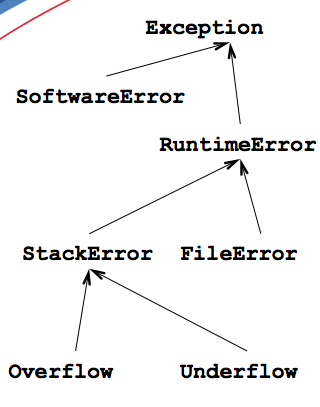

## Исключения. Преобразования типов

###  Традиционная обработка ошибок

Техники обработки ошибок

- прекратить выполнение
- возвратить значение «ошибка»
- возвратить допустимое значение и оставить программу в ненормальном состоянии
- вызвать функцию обработки ошибок

_Вариант 1. Прекратить выполнение программы_

```cpp
char Stack::pop()
{
  assert( top != 0 );
  return store[--top];
}
```

Результат:

```
stack_assert: simple_stack.cpp:61:
char Stack::pop (): Assertion ‘top != 0’ failed.
Abort (core dumped)
```

_Вариант 2. Возвратить ошибку_

```cpp
char Stack::pop() {
  return top ? store[--top] : 0;
}
```

Или так:

```cpp
enum tRC {
  OK,
  BAD_SIZE,
  OVERFLOW,
  UNDERFLOW
};

tRC Stack::pop(char* c)
{
  if (!top) return UNDERFLOW;
  *c=store[--top];
  return OK;
}

char Stack::pop(tRC* rc) {
  if (top) { 
    *rc=OK;
    return store[--top];
  }
  *rc=UNDERFLOW;
  return 0;
}
```

Проблемы:

- Может не быть подходящего значения
- Результат каждого вызова должен проверяться на «ошибку»


_Вариант 3. Оставить программу в ненормальном состоянии_

```cpp
char Stack::pop() {
  if (top!=0) { 
   return store[--top];
  }
  g_Error=UNDERFLOW;
  return 0;
}
 int main()
{
  Stack stack;
  char c = stack.pop();
  if (g_Error != OK)  {
    // error occured
  }
  else  {
    // OK
  }
}
```

_Вариант 4. Вызвать функцию обработки ошибок_

```cpp
void* new (size_t size)
{
  void* p;
  for(;;)
  {
    if (p = malloc(size))
      return p;
    if (!find_memory_somewhere())
      return 0;
  }
}
```


### Исключения

Механизм исключений (**exceptions**):

- Генерация сообщения об ошибке (**throw**)
- Перехват этих сообщений (**catch**)

В программе может одновременно существовать только одно исключение.

```cpp
class Stack {
public:
  Stack(int size);
  void push(char c);
  //...
};
class Overflow {};

class WrongSize {
public:
  int wsize;
   Wrong_size(int i):
         wsize(i) {}
};
void Stack::push(char c) {
 if (top<maxSize)
     storage[top++] = c;
 else
    throw Overflow();
}
void f() {
  try {
    Stack s(10);
    s.push('a');
  } catch (Overflow ex)  { 
       cerr << "Stack overflow";
  }
}
```

#### Выбор исключений

```cpp
Stack::Stack(int size)
{
  if ( size > 10000) {
    throw WrongSize(size);
  } //...
}
char Stack::pop()
{
  if (top==0)
    throw Underflow();
  
  return storage[--top];
}
void f(unsigned int size)
{
  try {
     Stack s(size);
     s.push('a');
     char c = s.pop();
     char d = s.pop();
  }
  catch (WrongSize ws) {
    cerr << "Wrong size:" << ws.wsize;
  }
  catch (Overflow) { /*...*/
  }
  catch (Underflow) { /*...*/
  } 
}
```

#### Группировка исключений

```cpp
class Exception {};

class StackError: public Exception {};

class Overflow:  public StackError {};
class Underflow: public StackError {};
class WrongSize: public StackError {};
...
try {
     Stack s(size);
     // ...
}
catch (WrongSize size_exc) {
   // process wronsize exception
}
catch (StackError) {
   // general processing
}
```

#### Перехват исключений



```cpp
try {
  //...
}
catch (StackError& se) {
  // process Stack Error
}
catch (RuntimeError& ps) {
  // process Runtime Error
}
catch (Exception) {
 // process Any Internal Exception
}
catch (...) {
  // process any other exception
}
```

```cpp
try {
  //...
}
catch (...) {
  // Все исключения перехватываются
  // здесь
}
catch (Exception* ex) {
 // process Any Internal Exception
}
catch (RuntimeError* re) {
  // process Runtime Error
}
catch (StackError* se) {
  // process Stack Error
}
```

#### Повторная генерация

```cpp
void f()
{
  try {
    // ...
    throw Underflow();
  }
  catch (RuntimeError& re) {
    if ( can_handle_it_completely(re) ) {
       // process the exception here
       return;
    }
    else {
       do_what_you_can_do(re);
       throw; 
    }
  }
}
void g()
{
  try {
    f();
  }
  catch (StackError& re) {
     // process stack error
  }
  catch (FileError& re) {
     // process file error
  }
}
```

#### Исключения в конструкторах

Классические подходы:

- Возвратить объект в «неправильном» состоянии
- Присвоить значение глобальной переменной
- Использовать функцию инициализации
- Осуществлять инициализацию при первом вызове функции-члена

```cpp
Stack::Stack(int i)
{
  if ( (i < MIN_SIZE) ||
       (i > MAX_SIZE) )
  {
    throw WrongSize(i);
  }
  //...
}
Stack* get_stack(int size)
{
  try {
   Stack* s = new Stack(size);
   //...
   return s;
  }
  catch (WrongSize) { 
    // handle bad stack size
  }
}
```
Объект не создан, пока не завершится выполнение его конструктора

```cpp
Schedule::Schedule(int i, Date d)
try
 : m_stack(i),
   m_date(d)
{
  // constructor
}
catch (Stack::Bad_Size) {
   // handle bad size of the stack member
}
catch (Date::Bad_Date) {
   // handle bad date of the date member
}
```

Копирующий конструктор подобен другим конструкторам:

- может генерировать исключения
- при этом объект не создается

Копирующее присваивание перед генерацией исключения должно убедиться, что оба операнда находятся в корректном состоянии


### Приведение типов

В языке С++ существует 4 разновидности выражений для приведения типов:

- **dynamic_cast**
- **static_cast**
- **reinterpret_cast**
- **const_cast**


### dynamic_cast

Используется для преобразования типов вниз по дереву наследования

```cpp
void f(Employee* pEmp)
{
   Programmer *pp = dynamic_cast< Programmer*>(pEmp);
   if (pp)
   {
       pp->team();
   }
}
void g(Employee& re)
{
   try {
     Programmer &rp = dynamic_cast< Programmer&>(re);
   } catch (bad_cast) {
       //...
   }
}
```

### static_cast

Используется для преобразований родственных типов (число в число)

```cpp
int *p = static_cast< int* >(malloc(100));

enum tColor {RED, GREEN, BLUE};
tColor c = static_cast< tColor >(2);

double d = 2.56;
int i = static_cast< int >(d);
```

### reinterpret_cast

Используется для преобразований чужеродных типов


```cpp
IO_device *p = reinterpret_cast< IO_device *>(0XffA01);

void* p = allocate_memory_for_programmer();
Programmer *p = reinterpret_cast< Programmer* >(p);
```

### const_cast

Используется для отмены **const**

```cpp
void f(const Worker* pw)
{
   Worker *pp = const_cast< Worker*>(pw);

   pp->new_name("Vasya");
}
...
const Worker w("Ivan", "Ivanov");

f(*w); //неопределнное поведение
```


