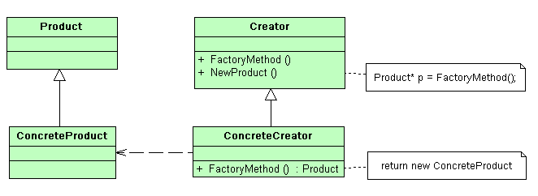

## Паттерны

### Введение

**Паттернами проектирования** — (Design Patterns) называют решения часто встречающихся проблем в области разработки программного обеспечения. Паттерны проектирования не являются готовыми решениями, которые можно трансформировать непосредственно в код, а представляют общее описание решения проблемы, которое можно использовать в различных ситуациях.

Существуют несколько типов паттернов проектирования, каждый из которых предназначен для решения своего круга задач:

- **Порождающие** паттерны, предназначенные для создания новых объектов в системе.
- **Структурные** паттерны, решающие задачи компоновки системы на основе классов и объектов.
- Паттерны **поведения**, предназначенные для распределения обязанностей между объектами в системе.

Зачем может понадобиться знание паттернов?

- **Проверенные решения**. Вы тратите меньше времени, используя готовые решения, вместо повторного изобретения велосипеда. До некоторых решений вы смогли бы додуматься и сами, но многие могут быть для вас открытием.

- **Стандартизация кода**. Вы делаете меньше просчётов при проектировании, используя типовые унифицированные решения, так как все скрытые проблемы в них уже давно найдены.

- **Общий программистский словарь**. Вы произносите название паттерна, вместо того, чтобы час объяснять другим программистам, какой крутой дизайн вы придумали и какие классы для этого нужны.


### Паттерн Singleton (одиночка)

```cpp
class OnlyOne
{
public:
        static OnlyOne& Instance()
        {
                static OnlyOne theSingleInstance;
                return theSingleInstance;
        }
private:        
        OnlyOne(){}
        OnlyOne(const OnlyOne& root) = delete;
        OnlyOne& operator=(const OnlyOne&) = delete;
};
```


### Паттерн Observer (наблюдатель)


Рассмотрим реализацию паттерна **Observer** (Наблюдатель)

```cpp
#include <vector>
#include <cstdio>


class Observer {
  public:
    virtual void update (float temperature, float humidity, int pressure)=0;
};

class Observable {
  public:
    virtual void registerObserver(Observer* o)=0;
    virtual void removeObserver(Observer* o)=0;
    virtual void notifyObservers()=0;
};

class WeatherData : public Observable {
  private:
    std::vector<Observer*> observers;
    float temperature=0;
    float humidity=0;
    int pressure=0;
  public:
    
    void registerObserver(Observer *o) override {
        observers.push_back(o);
    }

    void removeObserver(Observer *o) override {
        observers.erase(std::remove(observers.begin(), observers.end(), o), observers.end());
    }

    void notifyObservers() override {
        for (Observer* observer : observers)
            observer->update(temperature, humidity, pressure);
    }
         
    void setMeasurements(float temperature, float humidity, int pressure) {
        this->temperature = temperature;
        this->humidity = humidity;
        this->pressure = pressure;
        notifyObservers();
    }
};

class CurrentConditionsDisplay : public Observer {
  private:
    float temperature=0;
    float humidity=0;
    int pressure=0;
  public:
    
    void update(float temperature, float humidity, int pressure) {
        this->temperature = temperature;
        this->humidity = humidity;
        this->pressure = pressure;
        display();
    }

    void display() {
        printf("Сейчас значения:%.1f градусов цельсия и %.1f %% влажности. Давление %d мм рт. ст.\n", temperature, humidity, pressure);
    }
};

int main() {
   WeatherData* weatherData = new WeatherData;
   Observer* currentDisplay = new CurrentConditionsDisplay;
   weatherData->registerObserver(currentDisplay);
   weatherData->setMeasurements(29, 65, 745);
   weatherData->setMeasurements(39, 70, 760);
   weatherData->setMeasurements(42, 72, 763);
}
```

### Паттерн 'Пул объектов' (object pool)

```cpp
#include <vector>

class Object
{
	// ...
};


class ObjectPool
{
	private:
		struct PoolRecord
		{
			Object* instance;
			bool    in_use;
		};

		std::vector<PoolRecord> m_pool;

	public:
		Object* createNewObject()
		{
			for (size_t i = 0; i < m_pool.size(); ++i)
			{
				if (! m_pool[i].in_use)
				{
					m_pool[i].in_use = true; // переводим объект в список используемых
					return m_pool[i].instance;
				}
			}
			// если не нашли свободный объект, то расширяем пул
			PoolRecord record;
			record.instance = new Object;
			record.in_use   = true;

			m_pool.push_back(record);

			return record.instance;
		}

		void deleteObject(Object* object)
		{
			// в реальности не удаляем, а лишь помечаем, что объкт свободен
			for (size_t i = 0; i < m_pool.size(); ++i)
			{
				if (m_pool[i].instance == object)
				{
					m_pool[i].in_use = false;
					break;
				}
			}
		}

		virtual ~ObjectPool()
		{
			// теперь уже "по-настоящему" удаляем объекты
			for (size_t i = 0; i < m_pool.size(); ++i)
				delete m_pool[i].instance;
		}
};


int main()
{
	ObjectPool pool;
	for (size_t i = 0; i < 1000; ++i)
	{
		Object* object = pool.createNewObject();
		// ...
		pool.deleteObject(object);
	}
	return 0;
}
```

При использовании данного паттерна нужно иметь в виду:

1. После того, как объект возвращён, он должен вернуться в состояние, пригодное для дальнейшего использования. Если объекты после возвращения в пул оказываются в неправильном или неопределённом состоянии, такая конструкция называется **объектной клоакой**.
1. Повторное использование объектов также может привести к утечке информации. Если в объекте есть секретные данные (например, номер кредитной карты), после освобождения объекта эту информацию надо затереть.


### Паттрен "Фабричный метод"



