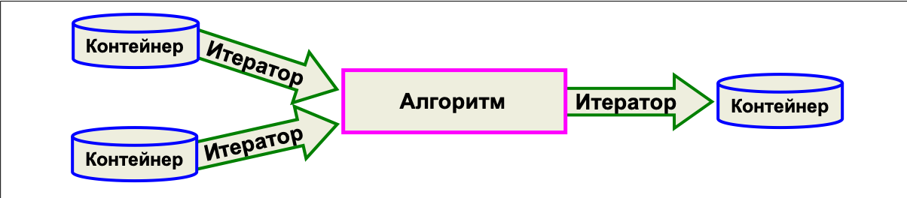
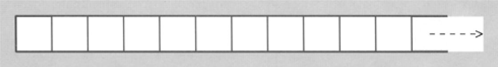
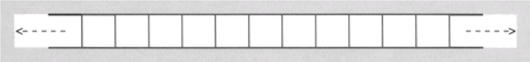
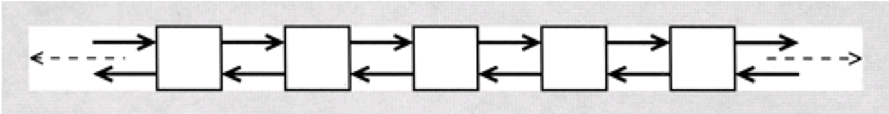
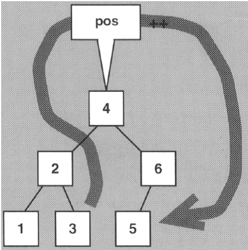
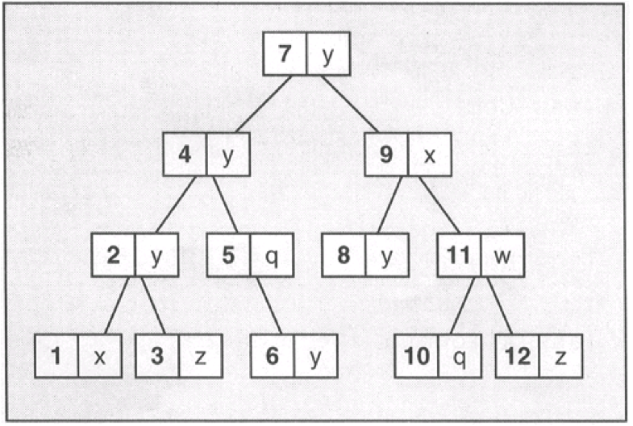

## Стандартная библиотека шаблонов

В этой и двух последующих лекциях мы затронем вопросы, связанные с **STL** - стандартной библиотекой шаблонов, входящей в состав стандартной библиотеки языка С++. Не будет преувеличением сказать, что STL составляет ядро стандартной библиотеки и является важнейшей ее частью, широко используемой в промышленном программировании.

### Общие сведения и состав STL

- контейнеры (хранение объектов),
- итераторы (доступ к элементам контейнера, инструмент для перебора элементов),
- алгоритмы (обработка элементов),
- контейнерные адаптеры (обёртки над контейнерами)
- функциональные объекты, функторы (обобщение функций)


**Контейнеры** предназначены для управления коллекциями объектов определенного типа. У каждой разновидности контейнеров имеются свои достоинства и недостатки.

**Итераторы** предназначены для перебора элементов в коллекциях объектов (контейнерах или их подмножествах). Главное достоинство итераторов - они предоставляют небольшой, но стандартный интерфейс, подходящий для любого типа контейнера.

**Алгоритмы** предназначены для обработки элементов коллекций. (Поиск, сортировку, модификацию и т.д.). В работе алгоритмов используются итераторы. Алгоритм достаточно запрограммировать только один раз для обобщенного контейнера, потому что интерфейс итераторов является общим для всех контейнеров.


Рисунок 1. Архитектура библиотеки

Все компоненты стандартной библиотеки С++ располагаются в пространстве имен **std**.

Компоненты STL оформлены в виде шаблонов и поэтому могут использоваться с произвольными типами элементов.

STL формирует архитектуру для включения других классов коллекций и алгоритмов, работающих в сочетании с существующими коллекциями и алгоритмами.

STL - хороший пример концепции унифицированного (обобщенного) программирования.


### Общие сведения о контейнерах

Контейнеры библиотеки STL можно разделить на два типа:

- последовательные (линейные),
- ассоциативные (нелинейные),

Общие вложенные типы

- Container::value_type
- Container::iterator
- Container::const_iterator


Контейнеры должны поддерживать *семантику значений* вместо *ссылочной семантики*. При вставке элемента контейнер создает его внутреннюю копию, вместо того чтобы сохранять ссылку на внешний объект.
Следовательно, элементы контейнера STL должны поддерживать копирование. 

Элементы в контейнере располагаются в определенном порядке. Это означает, что при повторном переборе с применением итератора порядок перебора элементов должен остаться прежним.
В каждом типе контейнера определены операции, возвращающие итераторы для перебора элементов.

В общем случае операции с элементами контейнеров небезопасны. Вызывающая сторона должна проследить за тем, чтобы параметры операции соответствовали требованиям.


### Общие методы контейнеров

|            Метод             |        Назначение   |
|------------------------------|----------------------------------------------------|
| ContType  c                  | Создает пустой контейнер, не содержащий элементов  |
| ContType c1(c2)              | Создает копию контейнера того же типа              |
| ContType c(beg,end)          | Создает контейнер и инициализирует его копиями всех элементов в интервале [beg, end) |
| c.~ContType()                | Удаляет все элементы и освобождает память          |
| c.size()                     | Возвращает фактическое количество элементов        |
| c.empty()                    | Проверяет, пуст ли контейнер (эквивалент size()==0, но иногда выполняется быстрее) |
| c.max_size()                 | Возвращает максимально возможное количество элементов (в общем случае, совпадает c максимальным значением типа индекса) |
| c1 == 2                      | Проверяет равенство с1 и с2  |
| c1 != c2                     | Проверяет неравенство с1 и с2 (эквивалентно !(с1 == с2) ) |
| c1 < c2                      | Проверяет, что c1 меньше c2 (лексикографически) |
| c1 > c2                      | Проверяет, что c1 больше c2 (эквивалент c2 < c1 )  |
| c1 <= c2                     | Проверяет, что c1 не больше с2 (эквивалент !(с2 < с1) ) |
| c1 >= c2                     | Проверяет, что c1 не меньше с2 (эквивалент !(с1 < с2)) |
| c1 = c2                      | Присваивает с1 все элементы с2  |
| c1.swap(c2)                  | Меняет местами содержимое с1 и с2 (гораздо эффективнее, чем =)|
| swap(c1,c2)                  | То же, но в форме глобальной функции  |
| c.begin()                    | Возвращает итератор для первого элемента |
| c.end()                      | Возвращает итератор для позиции за последним элементом |
| c.rbegin()                   | Возвращает обратный итератор для первого элемента при переборе в обратном направлении |
| c.rend()                     | Возвращает обратный итератор для позиции за последним элементом при переборе в обратном направлении |
| c.insert(pos,elem)           | Вставляет копию elem  (с разными вариантами возвращаемого значения и интерпретацией первого аргумента)  |
| c.erase(beg,end)             | Удаляет все элементы из интервала [beg, end) (некоторые контейнеры воэвращакэт следующий элемент после удаленного интервала) |
| c.clear()                    | Удаляет из контейнера все элементы (контейнер остается пустым) |


### Последовательные контейнеры

**Последовательные контейнеры** – упорядоченные коллекции, в которых каждый элемент занимает определенную позицию. Позиция зависит от времени и места вставки, но не связана со значением элемента. 


#### Контейнер *array*

Контейнер **array** является оберткой над обычным статическим массивом. Размер контейнера определяется во время объявления и в дальнейшем не может быть изменен.

```c++
#include <array>
std::array<std::string, 3> a = {"One", "Two", "Three"};
std::cout << a.size() << std::endl;
std::cout << a[1] << std::endl;
```

#### Контейнер *vector*

Наиболее популярный последовательный контейнер. Обеспечивает быструю вставку и удаление элемента с одного конца.


Рисунок 2. Схематическое изображение вектора

- Элементы вектора копируются во внутренний динамический массив.
- Вектор является упорядоченной коллекцией, т.е. элементы всегда хранятся в определенном порядке.
- Вектор обеспечивает произвольный доступ к своим элементам. Обращение к любому элементу с известной позицией выполняется напрямую и с постоянным временем.
- Итераторы векторов являются итераторами произвольного доступа, что позволяет применять к векторам все алгоритмы STL.
- Операции присоединения и удаления элементов в конце вектора выполняются с высоким быстродействием.
- Если элементы вставляются или удаляются в середине или в начале, быстродействие снижается, поскольку все элементы в последующих позициях приходится перемещать на новое место. На самом деле для каждого последующего элемента вызывается оператор присваивания.
- Один из способов повышения быстродействия векторов заключается в выделении для вектора большего объема памяти, чем необходимо для хранения всех элементов
- Векторы поддерживают стандартные операции проверки размера **size()**, **empty()** и  **max_size()**.
- Функция **capacity()** возвращающая максимальное количество элементов, которые могут храниться в текущей выделенной памяти. Если количество элементов превысит это значение, вектору придется перераспределить свою внутреннюю намять.
- Емкость вектора необходимо учитывать по двум причинам:
  - в результате перераспределения памяти становятся недействительными все ссылки, указатели и итераторы элементов вектора;
  - на перераспределение памяти требуется время.


Чтобы предотвратить перераспределение памяти, можно заранее зарезервировать некоторую емкость функцией **reserve()**.

```c++
std::vector<int> v; // Создание пустого вектора
v.reserve(80);      // Резервирование памяти для 80 элементов (БЕЗ вызова конструкторов в отличии от resize().)
```

Либо можно проинициализировать вектор достаточным количеством элементов, для чего конструктору передается начальный размер вектора:

```c++
std::vector<T> v(5); // Создание вектора и его инициализация пятью значениями (с пятикратным вызовом конструктора по умолчанию типа T
```

Емкость вектора напрямую никогда не уменьшается. 

```c++
template <class T>
void shrinkCapacity(std::vector<T>& v)
{
    std::vector<T> tmp(v); // Копирование элементов в новый вектор
    v.swap(tmp);           // Перестановка внутренних данных векторов
} 
```

После вызова функции **swap()** все ссылки, указатели и итераторы продолжают ссылаться на первоначально выделенную память.
Т.е. все ссылки, указатели и итераторы становятся недействительными.

Некоторые важные операции над вектором:

|            Метод             |        Назначение   |
|------------------------------|----------------------------------------------------|
| c.at(idx)                    | Возвращает элемент с индексом idx (при недопустимом значении индекса генерируется исключение out_of_range) |
| c[idx]                       | Возвращает элемент с индексом idx (без интервальной проверки!) |
| c.front()                    | Возвращает первый элемент (без проверки его существования!) |
| c.back()                     | Возвращает последний элемент (без проверки его существования!) |
| c.begin()                    | Возвращает итератор произвольного доступа для первого элемента |
| c.end()                      | Возвращает итератор произвольного доступа для позиции за последним элементом |
| c.rbegin()                   | Возвращает обратный итератор для первого элемента при переборе в обратном направлении |
| c.rend()                     | Возвращает обратный итератор для позиции за последним элементом при переборе в обратном направлении |
| c.insert(pos, elem)          | Вставляет в позицию итератора pos копию элемента elem и возвращает позицию нового элемента  |
| c.insert(pos, n, elem)       | Вставляет в позицию итератора pos n копий элемента elem (и не возвращает значения) |
| c.insert(pos, beg, end)      | Вставляет копию всех элементов интервала [beg,end) в позицию итератора pos (и не возвращает значения)  |
| c.push_back(elem)            | Присоединяет копию elem в конец вектора  |
| c.resize(num)                | Приводит контейнер к размеру num (если size() при этом увеличивается, новые элементы создаются своим конструктором по умолчанию) |
| c.resize(num, elem)          | Приводит контейнер к размеру num (если size() при этом увеличивается, новые элементы создаются как копии elem)  |
| c.pop_back()                 | Удаляет последний элемент (не возвращая его)  |
| c.erase(pos)                 | Удаляет элемент в позиции итератора pos и возвращает позицию следующего элемента |
| c.erase(beg, end)            | Удаляет все элементы из интервала [beg, end) и возвращает позицию следующего элемента  |
| c.clear()                    | Удаляет все элементы (контейнер остается пустым) |


```cpp
std::vector<Elem> coll;
...
// Удаление всех элементов со значением val 
coll.erase(remove(coll.begin(),coll.end(),
                  val),coll.end());
```

```cpp
vector<Elem> coll;
...
// Удаление первого элемента со значением val 
vector<Elem>::iterator pos
    = find(coll.begin(),coll.end(), val);
if (pos != coll.end())
    coll.erase(pos);
```


Итераторы остаются действительными до момента

- вставки
- или удаления элемента с меньшим индексом
- или перераспределения памяти

Согласно стандарту, исключения генерирует только одна функция **at()** - безопасная версия оператора индексирования.


Пример использования вектора:

```cpp
#include <iostream>
#include <vector>
using namespace std;

int main()
{
    vector<int> coll;    // Вектор с целыми элементами

    // Присоединение элементов со значениями от 1 до 6
    for (int i=1; i< = 6; ++i) {
        coll.push_back(i);
    }

    // Вывод элементов, разделенных пробелами
    for (int i=0; i < coll.size(); ++i) {
        cout << coll[i] << ' ';
    }
}
```


#### Контейнер *deque*

Контейнер c возможностью быстрой вставки и удаления элементов на обоих концах за O(1). Реализован как список указателей на массивы фиксированного размера.

Дек очень похож на вектор. Он обладает практически тем же интерфейсом и поддерживает произвольный доступ. Дек быстро выполняет операции вставки и удаления как с конца, так и с начала.


Рисунок 3. Схематическое изображение дека


По своим возможностям деки во многом отличаются от векторов:

- Вставка и удаление выполняются быстро как в начале, так и в конце.
- Операции выполняются с амортизированным постоянным временем.
- Внутренняя структура содержит дополнительный уровень ссылок, поэтому обращение к элементам и перемещение итератора в деках обычно выполняются чуть медленнее.
- Итераторы должны быть умными указателями особого типа.
- Обычные указатели не подходят из-за необходимости перехода между блоками.
- В системах с ограниченными размерами блоков памяти дек может содержать больше элементов, поскольку он не ограничивается одним блоком памяти. Следовательно, функция max_size() может возвращать для деков большую величину.
- Деки не позволяют управлять емкостью и моментом перераспределения памяти. При любых операциях вставки и удаления, выполняемых не в начале или конце вектора, становятся недействительными все указатели, ссылки и итераторы элементов дека.
- Перераспределение памяти в общем случае выполняется более эффективно, чем для векторов, потому что декам не приходится копировать все элементы.
- Освобождение неиспользуемых блоков может привести к уменьшению объема памяти, занимаемой деком (происходит ли это и как - зависит от реализации).

Следующие особенности векторов характерны также и для деков:

- Дек является упорядоченной коллекцией, т.е. элементы всегда хранятся в определенном порядке.
- Итераторы деков являются итераторами произвольного доступа, что позволяет применять к векторам все алгоритмы STL.
- Вставка и удаление элементов в середине контейнера выполняется относительно медленно, потому что для освобождения места или заполнения пропуска приходится перемещать элементы с обоих концов.

|            Метод             |        Назначение   |
|------------------------------|----------------------------------------------------|
| c.at(idx)                    |  Возвращает элемент с индексом idx (при недопустимом значении индекса генерируется исключение out_of_range) |
| c[idx]                       |  Возвращает элемент с индексом idx (без интервальной проверки!) |
| c.front()                    |  Возвращает первый элемент (без проверки его существования!) |
| c.back()                     |  Возвращает последний элемент (без проверки его существования!)  |
| c.insert(pos, elem)          |  Вставляет в позицию итератора pos копию элемента elem и возвращает позицию нового элемента  |
| c.insert(pos, n, elem)       |  Вставляет в позицию итератора pos n копий элемента elem (и не возвращает значения) |
| c.insert(pos, beg, end)      |  Вставляет копию всех элементов интервала [beg,end) в позицию итератора pos (и не возвращает значения)  |
| c.push_back(elem)            |  Присоединяет копию elem в конец дека  |
| c.push_front(elem)           |  Присоединяет копию elem в начало дека  |
| c.resize(num)                |  Приводит контейнер к размеру num (если size() при этом увеличивается, новые элементы создаются своим конструктором по умолчанию) |
| c.resize(num, elem)          |  Приводит контейнер к размеру num (если size() при этом увеличивается, новые элементы создаются как копии elem)|| c.pop_back()                 |  Удаляет последний элемент (не возвращая его)  |
| c.pop_front()                |  Удаляет первый элемент (не возвращая его)  |
| c.erase(pos)                 |  Удаляет элемент в позиции итератора pos и возвращает позицию следующего элемента |
| c.erase(beg, end)            |  Удаляет все элементы из интервала [beg, end) и возвращает позицию следующего элемента  |
| c.clear()                    |  Удаляет все элементы (контейнер остается пустым)  |
  
```c++
deque<Elem> coll;
...
// Удаление первого элемента со значением val 
deque<Elem>::iterator pos= find(coll.begin(),coll.end(), val);
if (pos != coll.end())
    coll.erase(pos);
```

Деки не поддерживают методы, связанные с емкостью (**capacity()** и **reserve()**).

В деках определены прямые функции вставки и удаления первого элемента: **push_front()** и **pop_front()**.


#### Контейнер *list*

Двусвязный список. В любом месте контейнера вставка и удаление производятся за O(1).

```c++
std::list<string> strngs {"One", "Two", "Three"}; 
for (std::string & s : strngs)
    std::cout << s << std::endl;
```


Рисунок 4. Схематическое изображение списка

- Список не поддерживает произвольный доступ к элементам.
- Вставка и удаление элементов в любой позиции выполняются быстро.
- В результате вставки и удаления элементов указатели, ссылки и итераторы, относящиеся к другим элементам, остаются действительными.
- Обработка исключений в списках реализована так, что практически каждая операция завершается успешно или не вносит изменений – транзакционная безопасность. 

Эти принципиальные различия отражены в функциях списков, что делает их непохожими на функции векторов и деков:

- В списках не определены ни оператор индексирования, ни метод at().
- Списки не поддерживают операции, связанные с емкостью и перераспределением памяти.
- Списки поддерживают много специальных методов для перемещения элементов.

Эти методы представляют собой оптимизированные версии одноименных универсальных алгоритмов. Оптимизация основана на замене указателей вместо копирования и перемещения значений.

Список поддерживает стандартный набор:

- операций создания и уничтожения списка (c(), c(c2), c(n), c(n,elem), c(beg,end), ~c)
- немодифицирующих операций (size, empty, max_size, ==, !=, <, >, <=, >=)
- операций присваивания (=, assign, swap)
- операций прямого обращения (front, back)
- методов получения итераторов (begin, end, rbegin, rend)
- операций вставки и удаления (insert, push_back, pop_back, push_front, pop_front, erase, resize, clear)

Специальные операции

- **c.remove(val)** - Удаляет все элементы со значением val 
- **c.remove_if(op)** - Удаляет все элементы, для которых op(elem) возвращает true


|            Метод             |        Назначение   |
|------------------------------|----------------------------------------------------|
| c1.splice(pos,c2)            | Перемещает все элементы с2 в с1 перед позицией итератора pos |
| c1.splice(pos,c2,c2pos)      | Перемещает все элементы с2, начиная с позиции итератора c2pos, в список с1 перед позицией итератора pos |
| c1.splice(pos,c2,c2beg,c2end)| Перемещает все элементы интервала [c2beg,c2end) списка с2 перед позицией итератора pos в список с1 (с1 и с2 могут совпадать) |
| c.unique()                   | Удаляет дубликаты (элементы с одинаковыми эначениями) |
| c.unique(op)                 | Удаляет дубликаты (элементы с одинаковыми значениями), для которых ор возвращает true |
| c.sort()                     | Сортирует все элементы оператором < |
| c.sort(op)                   | Сортирует все элементы по критерию ор |
| c1.merge(c2)                 | Перемещает все элементы с2 в с1 с сохранением сортировки (предполагается, что оба контейнера содержат отсортированные элементы) |
| c1.merge(c2,op)              | Перемещает все элементы с2 в с1 с сохранением сортировки по ор() (предполагается, что оба контейнера содержат элементы, отсортированные по критерию ор()) |
| c.reverse()                  | Переставляет все элементы в обратном порядке |

### Ассоциативные контейнеры

**Ассоциативные контейнеры** автоматически сортируют свои элементы по некоторому критерию. Критерий представляется в виде функции, которая сравнивает либо значения, либо специальные ключи, определяемые для этих значений.

По умолчанию элементы или ключи контейнеров сравниваются при помощи оператора <. Но можно передать в контейнер собственную функцию сравнения и определить новый порядок сортировки.

Критерий сортировки также применяется при проверке на равенство: два элемента равны, если каждый из них не больше другого.

Ассоциативные контейнеры обычно реализуются в виде сбалансиорванных бинарных деревьев. У каждого элемента (узла) есть один родитель и два потомка. Все предки слева от узла имеют меньшие значения, а все предки справа - большие значения.

Ассоциативные контейнеры различаются по типу элементов и по тому, как они обходятся с дубликатами.

STL содержит четыре стандартных класса ассоциативных контейнеров:

- **Множества (set)** - коллекции, в которых элементы сортируются в соответствии с их значениями. Каждый элемент присутствует в коллекции только в одном экземпляре, дубликаты не разрешаются.
- **Мультимножества (multiset)** - то же, что и множества, но с возможностью хранения дубликатов. Т.е., мультимножество может содержать несколько элементов с одинаковыми значениями.
- **Отображения (map)** - коллекции, состоящие из пар «ключ/значение». У каждого элемента имеется ключ, определяющий порядок сортировки, и значение. Каждый ключ присутствует в коллекции только в одном экземпляре, дубликаты не разрешаются.
- **Мультиотображения (multimap)** - то же, что и отображения, но с возможностью дублирования ключей. Это означает, что мультиотображение может содержать несколько элементов с одинаковыми ключами.


Рисунок 5. Множества на основе деревьев

#### Множества

```c++
#include <iostream>
#include <set>

int main()
{
    // Тип коллекции
    typedef std::set<int> IntSet;
    IntSet coll;        // Контейнер для целых чисел

    // Вставка элементов со значениями от 1 до 6
    // - значение 1 вставляется дважды
    coll.insert(3);    coll.insert(1);    coll.insert(5);
    coll.insert(4);    coll.insert(1);    coll.insert(6);
    coll.insert(2);

    // Вывод содержимого множества
    // - перебор всех элементов.
    IntSet::const_iterator pos;
    for (pos = coll.begin(); pos != coll.end(); ++pos) {
        std::cout << *pos << ' ';
    }
}
```

Результат:

```
1 2 3 4 5 6
```

Пример с мультимножеством:

```c++
#include <iostream>
#include <set>

int main()
{
    // Тип коллекции
    typedef std::multiset<int> IntSet;
    IntSet coll;        // Контейнер для целых чисел

    // Вставка элементов со значениями от 1 до 6
    // - значение 1 вставляется дважды
    coll.insert(3);    coll.insert(1);    coll.insert(5);
    coll.insert(4);    coll.insert(1);    coll.insert(6);
    coll.insert(2);

    // Вывод содержимого множества
    // - перебор всех элементов.
    IntSet::const_iterator pos;
    for (pos = coll.begin(); pos != coll.end(); ++pos) {
        std::cout << *pos << ' ';
    }
}
```

Результат:

```
1 1 2 3 4 5 6
```

#### Отображения

Элементами отображений и мультиотображений являются пары «ключ/значение».



Рисунок 6. Отображения на основе деревьев


Поэтому синтаксис объявления, вставки и обращения к элементам несколько изменяется, а именно:

Для вставки элемента в коллекцию необходимо создать объект pair. Задача может решаться с помощью вспомогательной функции **make_pair()**.

Итератор ссылается на пару «ключ/значение», поэтому мы не можем просто направить его в выходной поток данных. Вместо этого приходится работать с отдельными членами структуры pair, которым присвоены имена **first** и **second**: 
 - выражение **pos->first** определяет первый компонент пары «ключ/значение», то есть ключ элемента мультиотображения.
 - выражение **pos->second** определяет второй компонент пары «ключ/значение», то есть значение элемента мультиотображения.
(Как и в случае с обычными указателями, это выражение представляет собой сокращенную запись для `(*pos).second`.)


```c++
#include <iostream>
#include <map>
#include <string>
using namespace std;
int main() {
    // Тип коллекции
    typedef multimap<int, string> IntStringMMap;
    IntStringMMap coll;  // Контейнер для хранения пар int/string

    // Вставка элементов в произвольном порядке
    // - значение с ключом 1 вставляется дважды.
    coll.insert(make_pair(5,"tagged"));   coll.insert(make_pair(2,"a"));
    coll.insert(make_pair(1,"this"));     coll.insert(make_pair(4,"of"));
    coll.insert(make_pair(6,"strings"));  coll.insert(make_pair(1,"is"));
    coll.insert(make_pair(3,"multimap"));

    // Вывод содержимого контейнера
    // - перебор всех элементов
    // - переменная second содержит значение.
    IntStringMMap::iterator pos;
    for (pos = coll.begin(); pos != coll.end(); ++pos) {
        cout << pos->second << ' ';
    }
}
```

При работе с отображениями операция вставки может осуществляться оператором индексирования []:

Индекс используется в качестве ключа и может иметь произвольный тип.

Оператор индексирования в данном случае работает не так, как обычный оператор индексирования массивов. Отсутствие элемента, связанного с индексом, не является ошибкой. При появлении нового индекса (или ключа) создается и вставляется в контейнер новый элемент, ключом которого является указанный индекс. Таким образом, в ассоциативных массивах индекс в принципе не может принимать недопустимое значение.

```c++
std::map<string, float> coll;
coll["Pi"] = 3.1415;
coll["Null"] = 0;
```

Следовательно, в приведенном коде создаются новые элементы. А оператор присваивания связывает ключи со значениями, преобразованными к типу **float**.

```c++
#include <iostream>
#include <map>
#include <string>
using namespace std;

int main()
{
    // Тип контейнера: map
    // - элементами являются пары "ключ/значение" типов string / float
    typedef map<string,float> StringFloatMap;
    StringFloatMap coll;

    // Вставка элементов в коллекцию
    coll["VAT"] = 0.15;                       coll["Pi"] = 3.1415;
    coll["an arbitrary number"] = 4983.223;   coll["Null"] = 0;

    // Вывод содержимого коллекции - перебор всех элементов
    // - first содержит ключ, second содержит значение
    StringFloatMap::iterator pos;
    for (pos = coll.begin(); pos != coll.end(); ++pos) {
        cout << "key: \"" << pos->first << "\" "
             << "value: " << pos->second << endl;
    }
}
```

```
key: "Null" value: 0
key: "Pi" value: 3.1415
key: "VAT" value: 0.15
key: "an arbitrary number" value: 4983.22 
```


