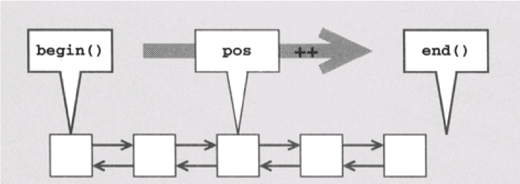

## Стандартная библиотека шаблонов (продолжение)

### Итераторы

**Итератор** - объект, предназначенный для перебора элементов контейнера STL (всех или некоторого подмножества).
Итератор представляет некоторую позицию в контейнере.

Основные операторы, работу с которыми поддерживает итератор:

- * - получение элемента в текущей позиции итератора.
- -> - Если элемент состоит из отдельных членов, для обращения к ним неносредственно через итератор используется оператор ->.
- ++ - перемещение итератора к следующему элементу. Многие итераторы также поддерживают перемещение в обратном направлении, для чего используется оператор --.
- == и != - проверка совпадений позиций, представленных двумя итераторами.
- = - присваивание итератора (позиции элемента, на которую он ссылается).

Этот набор операторов (*, ->, ++, --, ==, !=, =) в точности соответствует интерфейсу обычных указателей С/С++ при переборе элементов массива. Поэтому итераторы иногда называют «обобщенными указателями».

Для обычного массива обычный указатель является итератором.

**Итераторы** – «умные указатели» - обеспечивают перебор в более сложных контейнерных структурах данных.

Внутреннее поведение итератора зависит от структуры данных, в которой осуществляется перебор. Каждая разновидность контейнеров обладает собственным итератором.

Все итераторы обладают одинаковым интерфейсом, но имеют разные типы.

В итоге мы приходим к концепции унифицированного программирования: операции выполняются с одинаковым интерфейсом, но с разными типами, что позволяет использовать шаблоны для определения унифицированных операций, работающих с произвольными типами, которые поддерживают заданный интерфейс.

Использование операции ++

- ++pos; // правильно и быстро
- pos++; // правильно, но не быстро


#### Категории итераторов

- Итератор ввода (чтение в прямом направлении)
- Итератор вывода (запись в прямом направлении)
- Прямой итератор (чтение и запись в прямом направлении)
- Двунаправленный итератор (запись и чтение в прямом и обратном направлении). Операции: ++,--. Контейнеры: **list, set, map**
- Итератор произвольного доступа (чтение и запись с произвольным доступом). Операции: ++, --, арифметика, <, >, <=, >=. Контейнеры: **array, vector, deque**. 

#### Методы begin() и end()

Все контейнеры поддерживаются базовые функции, применяемые для перебора элементов при помощи итераторов:



**begin()** - возвращает итератор, установленный в начало последовательности элементов контейнера. Началом считается позиция первого элемента (если он есть).
**end()** - возвращает итератор, установленный в конец последовательности элементов контейнера. Концом считается позиция за последним элементом.

Функции **begin()** и **end()** определяют полуоткрытый интервал [b, e), который содержит первый элемент, но выходит за пределы последнего элемента. 

Полуоткрытый интервал обладает двумя достоинствами:

- появляется простое условие завершения перебора в контейнере: цикл продолжается до тех пор, пока не будет достигнута позиция end()
- предотвращается специальная обработка пустых интервалов, поскольку в пустом интервале begin() совпадает с end()

```cpp

#include <vector>
#include <iostream>
using namespace std;
int main() 
{
    vector<int> v = { 1, 2, 3, 4, 5 };  
    for (vector<int>::iterator it = v.begin(); it != v.end(); ++it)    
    {
        cout << *it << " ";
    }
    return 0; 
}
```


```cpp
#include <iostream>
#include <list>
using namespace std;

int main()
{
    list<char> coll;      // Список с символьными элементами

    // Присоединение элементов от 'a' до 'z'
    for (char c='a'; c<='z'; ++c) {
        coll.push_back(c);
    }

    // Вывод содержимого списка
    // - перебор всех элементов.
    list<char>::const_iterator pos;
    for (pos = coll.begin(); pos != coll.end(); ++pos) {
        cout << *pos << ' ';
    }
}
```

#### Константный итератор

В каждом контейнере определены два типа итераторов:

**контейнер::iterator** – используется для перебора элементов в режиме чтения/записи (аналог  T*)

**контейнер::const_ iterator** – используется для перебора элементов в режиме чтения  (аналог const T*)

#### Инкрементирование итераторов

Обычно, префиксная версия оператора ++ работает эффективнее постфиксной версии, которая создает временный объект для возвращения старой позиции итератора.

Пример с **map**:

```cpp
map<char,int> mymap;
mymap['b'] = 100;
mymap['a'] = 200;
mymap['c'] = 300;
for (map<char,int>::iterator it = mymap.begin(); it != mymap.end(); ++it) 
  cout << it->first << " => " << it->second << '\n';
```


#### Инвалидация итераторов

Некоторые операции над контейнерами делают существующие итераторы некорректными.

- Удаление делает некорректным итератор на удалённый элемент в любом контейнере.
- В vector и string добавление потенциально инвалидирует все итераторы (может произойти выделение нового буфера), иначе инвалидируются только итераторы на все следующие элементы.
- В vector и string удаление элемента инвалидирует итераторы на все следующие элементы.
- В deque удаление/добавление инвалидирует все итераторы, кроме случаев удаления/добавления первого или последнего элементов.

### Итераторные адаптеры

**Итераторные адаптеры** - классы, которые обладают интерфейсом итератора, но делают нечто совершенно иное. (По сравнению с обычными итераторами, которые предназначены лишь для перебора элементов коллекций.)

Существуют три вида итераторных адаптеров:

- обратные итераторы
- потоковые итераторы
- итераторы вставки

#### Обратные итераторы

Обратные итераторы - адаптеры, переопределяющие операторы ++ и -- так, что перебор элементов производится в обратном направлении.

Все стандартные контейнерные классы позволяют использовать обратные итераторы для перебора элементов.

Функции **rbegin()** и **rend()** возвращают обратный итератор. 

```cpp
vector<int> v{1, 2, 3, 4, 5};
for (vector<int>::reverse_iterator it = v.rbegin(); it != v.rend(); ++it)
{
    cout << *it;
} // печать 54321
```

#### Потоковые итераторы

В следующем примере итераторный адаптер выполняет вставку в стандартный поток вывода данных из вектора, разделяя их пробелами.

```cpp
#include <vector>
#include <iostream>
#include <iterator>
#include <algorithm>

using namespace std;
int main() 
{
    vector<int> v = { 1, 2, 3, 4, 5 };  
    copy(v.begin(),v.begin(),ostream_iterator<int>(cout," ");
    cout<<endl;
    return 0; 
}
```

#### Итераторы вставки

**Итераторы вставки** - позволяют использовать алгоритмы в режиме вставки (вместо режима перезаписи).

Итераторы вставки решают проблему с нехваткой места в приемном интервале при записи: приемный интервал просто увеличивается до нужных размеров.

```cpp
list<int> coll1;
    // Вставка элементов со значениями от 1 до 9 в первую коллекцию
    // в первую коллекцию
    for (int i = 1; i <= 9; ++i) {    coll1.push_back(i);    }

    // Копирование элементов из coll1 в coll2 с присоединением в конец
    vector<int> coll2;
    copy (coll1.begin(), coll1.end(),      // Источник
          back_inserter(coll2));           // Приемник
```

```cpp
    // Копирование элементов coll1 в coll3 со вставкой в начало
    // - порядок следования элементов заменяется на противоположный
    deque<int> coll3;
    copy (coll1.begin(), coll1.end(),      // Источник
          front_inserter(coll3));          // Приемник

    // Копирование элементов coll1 в coll4
    // - единственный итератор вставки, работающий
    //   с ассоциативными контейнерами
    set<int> coll4;
    copy (coll1.begin(), coll1.end(),      // Источник
          inserter(coll4, coll4.begin())); 
```


