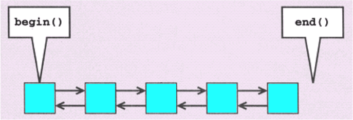
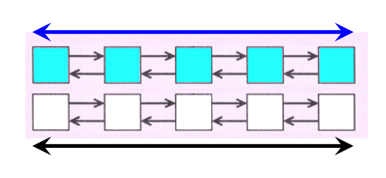
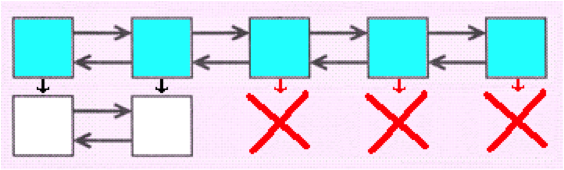

## Стандартная библиотека шаблонов (продолжение)

### Алгоритмы

**STL Алгоритмы** - стандартные алгоритмы, предназначенные для обработки элементов коллекций.

Под обработкой понимается выполнение таких стандартных операций, как поиск, сортировка, копирование, переупорядочение, модификация и численные расчеты.

Алгоритмы не являются методами контейнерных классов - это глобальные функции, работающие с итераторами.

Вместо того чтобы реализовывать каждый алгоритм для каждого типа контейнера, достаточно реализовать его один раз для обобщенного типа контейнера.

Такой подход сокращает объем программного кода, делая библиотеку более мощной и гибкой.

```cpp
using namespace std;

int main()
{
    vector<int> coll;

    // Вставка элементов от 1 до 6 в произвольном порядке
    coll.push_back(2);     coll.push_back(5);     coll.push_back(4);
    coll.push_back(1);     coll.push_back(6);     coll.push_back(3);

    // Поиск и вывод минимального и максимального элементов
    vector<int>::iterator pos;
    pos = min_element (coll.begin(), coll.end());
    cout << "min: " << *pos << endl;
    pos = max_element (coll.begin(), coll.end());
    cout << "max: " << *pos << endl;
    ...
```

Пример с сортировкой:

```cpp
..
    // Сортировка всех элементов
    sort (coll.begin(), coll.end());

    // Поиск первого элемента со значением, равным 3
    pos = find (coll.begin(), coll.end(),  // Интервал
                3);                        // Значение

    // Перестановка найденного элемента со значением 3
    // и всех последующих элементов в обратном порядке.
    reverse (pos, coll.end());

    // Вывод всех элементов
    for (pos = coll.begin(); pos != coll.end(); ++pos) {
        cout << *pos << ' ';
    }
    cout << endl;
}
```

#### Работа с интервалами

Все алгоритмы работают с полуоткрытыми интервалами.
Т.е., интервал включает заданную начальную позицию,
но конечная позиция в него не включается:

`[начало, конец)`



Вызывающая сторона должна проследить за тем, чтобы первый и
второй аргументы определяли действительный интервал, то есть итератор мог перейти от начала к концу интервала в процессе перебора элементов.

Оба итератора должны принадлежать одному контейнеру.
Начало интервала не должно находиться после его конца.
Некоторые алгоритмы работают сразу с несколькими интервалами.

Обычно в таких случаях задаются начало и конец только одного интервала для остальных интервалов задается только начало.

Таким образом, конечная позиция других интервалов определяется по количеству элементов в первом интервале.

Например, следующий вызов `equal()` поэлементно сравнивает все содержимое коллекции `coll1` с элементами `соll2`, начиная с первого:

```cpp
// Вызов equal() поэлементно сравнивает все содержимое
// коллекции coll1 с элементами соll2, начиная с первого элемента: 

if (  equal (coll1.begin(), coll1.end(),
             coll2.begin())              )
{
    ...
}
```

Вызывая алгоритм для нескольких интервалов, убедитесь в том, что второй и все прочие интервалы содержат не меньше элементов, чем первый интервал.



Размер приемных интервалов особенно важен для алгоритмов, осуществляющих запись в коллекцию.

```cpp
copy (coll1.begin(), coll1.end(), coll2.begin());
```


	
_Плохой пример_


```cpp
using namespace std;

int main()
{
    list<int>   coll1;
    vector<int> coll2; // пустая коллекция!

    // Вставка элементов со значениями от 1 до 9
    for (int i = 1; i <= 9; ++i) {
        coll1.push_back(i);
    }
    // ОШИБКА ВРЕМЕНИ ВЫПОЛНЕНИЯ:
    // - перезапись несуществующих элементов в приемнике
    copy (coll1.begin(), coll1.end(),     // Источник
          coll2.begin());                 // Приемник
    //...
```

_Исправленный пример_

```cpp
// Вставка элементов со значениями от 1 до 9
    for (int i = 1; i <= 9; ++i) {
        coll1.push_back(i);
    }
    // Изменение размера приемного интервала, чтобы он 
    // были достаточен для работы алгоритма с перезаписью.
    coll2.resize (coll1.size());

    copy (coll1.begin(), coll1.end(),     // Источник
          coll2.begin());                 // Приемник

    deque<int> coll3(coll1.size());

    copy (coll1.begin(), coll1.end(),     // Источник
          coll3.begin());                 // Приемник
}
```


	
	