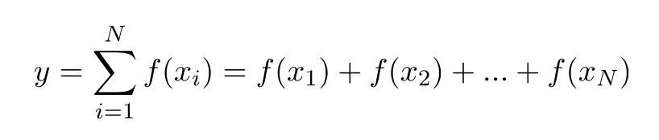

## Лямбда-функции


### Функторы

**Функторы** - это объекты, ведущие себя как функции. Для того чтобы объявить функтор надо перегрузить оператор ():

```c++
class Func
{
   int value=5;
   public:
     bool operator()(int val) {
       return (val>value)? true: false;
     }
};
```

Пример использования функтора:

```c++
int val;
cout<<"Enter a value:";
cin>>val;
cout<<Func(val)?"You won":"I won";
...
```

Функторы применяются в некоторых алгоритмах STL и они представляют собой объектно-ориентированную альтернативу указателям на функции.

Пример с сортировкой вектора по принципу четность/нечетность элементов (http://archive.kalnytskyi.com/2011/10/30/introduction-to-cpp11-part-3/):

```c++
#include <algorithm>
#include <vector>
#include <iostream>
using namespace std;

struct Comparator : public std::binary_function<int, int, bool>
{
    bool operator()(int lhs, int rhs) const // слева нечетные, а справа четные
    {
        if (lhs & 1  &&  rhs & 1)
            return lhs < rhs;
        return lhs & 1;
    }
};

int main()
{
   vector<int> vec{5,3,4,5,6,7,5,4,3,324,5};
   sort(vec.begin(), vec.end(), Comparator());
   for(int i:vec)
     cout<<i<<" ";
   return 0;
}
```

Еще один пример использования компаратора, при создании **std::set**:

```cpp
#include <iostream>
#include <set>
#include <utility>

struct Compare
{
    bool operator ()( const std::pair<int, int> &p1, 
                      const std::pair<int, int> &p2 ) const
    {
        return ( p1.second - p1.first  > p2.second - p2.first );
    }
};

int main() 
{
    std::set<std::pair<int, int>, Compare> s;

    return 0;
}
```

Сравните с использованием обычной функции:

```cpp
set<pair<int,int>, bool(*)(const pair<int,int> &lhs, 
                           const pair<int,int> &rhs) > myset(&compare);

```


Современной альтернативой функторам являются **лямбда-функции**.

### Лямбда-функции


Исходная задача:

Необходимо вычислять:



Традиционный подход заключается в том, чтобы организовать цикл, в котором будет вызываться **f**. При этом хочется, чтобы:

1. Сумма сама являлась функцией
1. Функцию **f** можно было бы определять вне суммы, но область видимости ее должна быть ограничена.


Реализация на **Scheme**

```scheme

(define (sum i N f s)
   (if (> i N) 
      s
      (sum (+ i 1) N f (+ s (f i))))
```

Вариант использования **sum**:

```scheme
(sum 1 100 (lambda (x) (* x x)) 0)
```

Механизм **лямбда-функций** относится к элементам функционального подхода к программированию и был включен в С++ в стандарте 2011 года. Если говорить коротко, то лямбда-функции представляют из себя безымянные функции, которые можно определять непосредственно при вызове.

Это очень удобно при обработке данных коллекций.

```c++
#include <vector>
#include <iostream>
#include <algorithm>
using namespace std;

int main()
{
    vector<int> v {1,2,3,4,5};
    for_each(begin(v),end(v),[](int n) {cout<<n<<endl;});

    return 0;
}
```

Конструкция `for_each`, определенная в заголовочном файле `algorithm` позволяет перебрать коллекцию и применить к каждому элементу данных лямбда-функцию.


Формат лямбды:

```c++
[captures](args) - > type { body }
```

- **captures** -  список захвата: переменных внешней среды, которые стоит сделать доступными внутри
- **args** - аргументы функции 
- **type** - тип возвращаемого значения
- **body** - тело функции

Пример (http://archive.kalnytskyi.com/2011/10/30/introduction-to-cpp11-part-3/):

```c++
int max = 4;

// по значению
sort(vec.begin(), vec.end(), [max](int lhs, int rhs) {
    return lhs < max;
});
// по ссылке
sort(vec.begin(), vec.end(), [&max](int lhs, int rhs) {
    return lhs < max;
});
```

Если написать `[=]` то будут захвачены копии всех переменных, а если `[&]` то ссылки на все переменные.

Функции можно сохранять в переменных:

```c++
auto square = [](int x) { return x * x; };
std::cout << square(16) << std::endl;
```

### Использование с алгоритмами

В следующем примере мы удаляем из вектора четные элемнты

```c++
vector< int > v = { 2, 4, 5, 6, 7, 9, 11, 14 };
auto end = remove_if( v.begin(), v.end(), []( int x ) { return x % 2 == 0; } );
for_each( v.begin(), end, []( int x ) { std::cout << x << " "; } );
```


### Пример с рекурсией

Вычисление n-ого числа ряда Фибоначчи:

```c++
#include <iostream>
using namespace std;

int main()
{

    function<int (int)> fib 
        = [&fib](int n) {return n<=2?1 : fib(n-1)+fib(n-2);};
    cout<<fib(2)<<endl;


    return 0;
}
```


### Пример

Если лямбда отмечена как изменяемая (например, `[]() mutable { })`, ей разрешено изменять значения, которые были зафиксированы по значению.


```c++
#include <iostream>
using namespace std;

function<int ()> f()
{
  int x=0;
  return [=]() mutable {return ++x; };
}

int main()
{
  auto fun=f();
  for(int i=0;i<10;i++)
    cout<<fun()<<endl;
  return 0;
}
```

### Возвращаемые типы лямбда-выражений

Рассмотрим программу:

```c++
#include <iostream>

int main() {

auto getcode = [](int x) {
    if(x>=0 && x<10)
        return 32;
    else
        return '!';
};

std::cout << getcode(20) << std::endl;

}
```

Данная программа не скомпилируется из-за того, что разные ветви **if** возвращают данные разных типов. В таких случаях можно авно указать тип возвращаемого лямбда-выражением значения

```c++
#include <iostream>

int main() {

auto getcode = [](int x)->char {
    if(x>=0 && x<10)
        return 32;
    else
        return '!';
};

std::cout << getcode(20) << std::endl;

}
```
Начиная со стандарта С++14 стало возможным указывать у функций в качестве возвращаемого типа **auto** (и не только у лмбда-функций!)


```c++
#include <iostream>

int main() {

auto getcode = [](int x)->auto {
    if(x>=0 && x<10)
        return (char)32;
    else
        return '!';
};

std::cout << getcode(20) << std::endl;

}
```

### Использование типов для хранения и передачи лямбда-выражений

Можно создавать лямбда-выражения и сохранять их в переменных **auto**:

```c++
auto fun = [](int x){ return x*x; }
```

Если захочется использовать тип:

```c++
#include <functional>
using namespace std;

function<int(int)> f = [](int x){ return x*x; }
```


Функция с формальным параметром:

```c++
void map(vector<int> v, function<int(int)> f) 
{
    for_each(begin(v),end(v), f);
}
```

### Более сложный пример

```c++
function<function<int(int)>(int)>
   gen = [](int val) -> function<int(int)>
   {
       return [val](int n) -> int
       {
          return n+val;
       };
   };
```


### Каррирование

```c++
// -std="c++14"

#include <iostream>

using namespace std;

int add(int x,int y)
{
  return x+y;
}

auto carryAdd(int x)
{
  return [=](int y) {
    return add(x,y);
  };
}

int main()
{
  cout<<carryAdd(5)(6)<<endl;
  return 0;
}
```

### Упражнение

> Реализуйте функцию `map`, которая принимает вектор и функцию в качестве параметров, а потом применяет функцию к каждому элементу вектора


### constexpr Lambdas

Начиная со стандарта С++17, появилась возможность использовать лябда-выражения в качестве **constexpr**:


```c++
auto squared = [](auto val) { 
   return val*val;
};
std::array<int,squared(5)> a;
```

Можно писать явно:

```c++
auto squared3i = [](int val) constexpr -> int {
     return val*val;
};
```


### Еще один пример с рекурсией

```c++
#include <iostream>
#include <functional>
using namespace std;

int main() {
  auto term = [](int a) -> int {
    return a*a;
  };

  auto next = [](int a) -> int {
    return ++a;
  };


  function<int(int,int)>
  sum = [term,next,&sum](int a, int b) -> int {
  if(a>b)
    return 0;
  else
    return term(a)+sum(next(a), b);
  };
  
  cout << sum(1,10);
  return 0;
}
```


