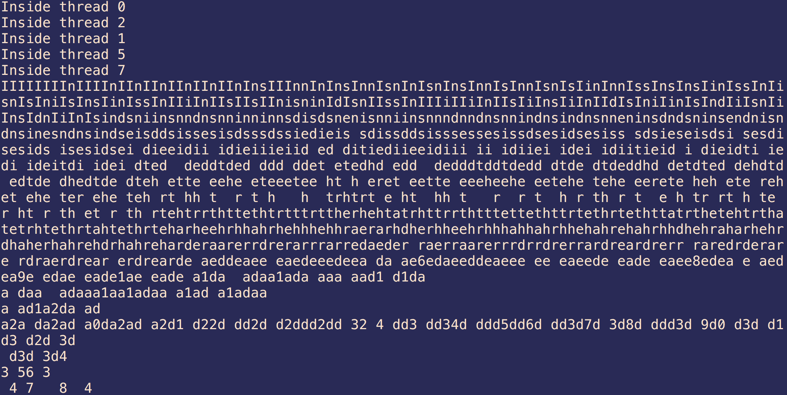

## Многопоточность

### Содержание

- [Простое создание потока](#Простое-создание-потока)
- [Временные задержки](#Временные-задержки)
- [Идентификатор потока](#Идентификатор-потока)
- [Измерение времени](#Измерение-времени)
- [Пример c алгоритмами сортировки](#Пример-с-алгоритмами-сортировки)
- [Потоки и лямбда-функции](#Потоки-и-лямбда-функции)
- [Гонка за ресурс](#Гонка-за-ресурс)
- [Синхронизация](#Синхронизация)
- [Atomic](#Atomic)
- [Реализация модели "потребитель-поставщик"](#Реализация-модели-"потребитель-поставщик")
- [Sync как альтернатива явному использованию threads](#Sync-как-альтернатива-явному-использованию-threads)


### Простое создание потока


Рассмотрим простой пример программы, создающей дополнительный поток:

```cpp
#include <iostream>
#include <thread>
using namespace std;

void fun()
{
   cout<<"Hello"<<endl;
}

int main()
{
   thread t(fun);
   cout<<"Main"<<endl;
   t.join();
   return 0;
}
```

Используется класс `thread`, конструктору которого при создании экземпляра передается функция, исполняющаяся в теле потока. Выполнение функции начинается сразу, после создания потока.

Вызов `join()` позволяет остановить главный поток до завершения работы созданного потока.


### Временные задержки


В процессе работы потока часто необходимо организовать задержку. Для этой цели используют вызов `this_thread::sleep_for(chrono::milliseconds(t));`, где `t` -  количество миллисекунд. Также есть возможность использовать другие единицы времени, описанные в `chrono`.

```cpp
void fun()
{
   for(int i=0;i<5;i++) {
      cout<<"Hello"<<endl;
      this_thread::sleep_for(chrono::milliseconds(100));
   }
}
```

### Идентификатор потока

У каждого потока есть свой числовой **ID**, который можно узнать, вызвав метод `get_id()`:

```cpp
void fun()
{
   for(int i=0;i<5;i++) {
      cout<<"Hello from "<<this_thread::get_id()<<endl;
   }
}
```

### Измерение времени

Измеряем время между двумя состояниями программы. Объявляются переменные типа `chrono::system_clock::time_point`, в которые заносится текущее время функцией `chrono::system_clock::now()`.  Разница значений, преобразованная в требуемые единицы позволяет получить результат измерения.

```cpp
int main()
{
  chrono::system_clock::time_point start = chrono::system_clock::now();
  thread t1(tbody);
  thread t2(tbody);
  t1.join();
  t2.join();
  chrono::system_clock::time_point end=chrono::system_clock::now();
  auto total=chrono::duration_cast<chrono::milliseconds>(end - start).count();
  cout << total << endl;
  return 0;
}
```

### Пример с алгоритмами сортировки

Рассмотрим программу, которая запускает в различных потоках методы сортировки. Каждый поток сортирует копию одного и того же массива и сообщает в конце об окончании процедуры. Программа дает представление о скорости работы некоторых алгоритмов.

```cpp
#include <iostream>
#include <thread>
#include <cstdlib>
#include <ctime>
using namespace std;
typedef short artype;
typedef unsigned long long ull;
enum class SortTypes {Quick,Bubble,Insertion};
artype* createArray(ull size)
{
 artype *arr = new artype[size];
 for (ull i = 0; i < size; ++i)
  arr[i] = rand() % 100;
 return arr;
}
void QuickSort(artype* a, ull lo, ull hi)
{
 ull i = lo, j = hi, h;
 artype x = a[(lo + hi) / 2];
 do
 {
  while (a[i]<x) i++;
  while (a[j]>x) j--;
  if (i <= j)
  {
   h = a[i]; a[i] = a[j]; a[j] = h;
   i++; j--;
  }
 } while (i <= j);
 if (lo<j) QuickSort(a, lo, j);
 if (i<hi) QuickSort(a, i, hi);
}
void BubbleSort( artype *a, ull N)
{
 ull i, j;
 for (i = N - 1; i>0; i--)
 for (j = 0; j<i; j++)
 if (a[j]>a[j + 1])
 {
  artype t = a[j];
  a[j] = a[j + 1];
  a[j + 1] = t;
 }  
}
void InsertionSort(artype *A, ull N) {
 ull i, j; 
 artype temp;
 for (i = 1; i<N; i++) { 
  j= i; 
  temp = A[i]; 
  while (j>0 && temp<A[j - 1]) { 
   A[j] = A[j - 1]; 
   j--; 
  } 
  A[j] = temp; 
 }
}
void tbody(artype *arr, ull size, SortTypes type)
{
 switch (type)
 {
 case SortTypes::Bubble:
  BubbleSort(arr, size);
  cout << "Bubble finished!" << endl;
  break;
 case SortTypes::Insertion:
  InsertionSort(arr, size);
  cout << "Insertion finished!" << endl;
  break;
 case SortTypes::Quick:
  QuickSort(arr, 0,size-1);
  cout << "Quick finished!" << endl;
  break;
 }
}
int main()
{
 const ull size = 50000;
 srand(time(0));
 artype *arr1 = createArray(size);
 artype *arr2 = new artype[size];
 artype *arr3 = new artype[size];
 memcpy(arr2, arr1, size*sizeof(artype));
 memcpy(arr3, arr1, size*sizeof(artype));
 thread t1(tbody, arr1,size, SortTypes::Bubble);
 thread t2(tbody, arr2,size, SortTypes::Insertion);
 thread t3(tbody, arr3,size, SortTypes::Quick);
 t1.join();
 t2.join();
 t3.join();
 cout << "Race ended!" << endl;
 delete[] arr1;
 delete[] arr2;
 delete[] arr3;
}
```
### Потоки и лямбда-функции

В следующем примере приводится код программы, в которой создаются две пары потоков и каждая пара заполняет один вектор значениями (четными и нечетными). В качестве тел потоков используются лямбда-функции.

```cpp
#include <iostream>
#include <thread>
#include <vector>
#include <algorithm>
using namespace std;


int main()
{
 vector<int> v1(20);
 vector<int> v2(20);
 thread t1([&v1](int a, int b) {
  for (int i = a; i <= b; i++)
  do v1[i] = rand() % 100; while (v1[i] % 2);
 }, 0, 9);

 thread t2([&v1](int a, int b) {
  for (int i = a; i <= b; i++)
  do v1[i] = rand() % 100; while (!(v1[i] % 2));
 }, 10, 19);
 thread t3([&v2]() {
  for_each(v2.begin(), v2.begin() + 10, [](int &n) {
   n= rand() % 100;
  });
 });
 thread t4([&v2]() {
  for_each(v2.begin()+10, v2.end(), [](int &n) {
   n= rand() % 100;
  });
 });


 t1.join();
 t2.join();
 t3.join();
 t4.join();
 for (auto &item : v2)
  cout << item << " ";
 cout << endl;
 return 0;
}
```

### Гонка за ресурс

В следующем примере создается 100 потоков, каждый из которых стремится вывести строку на экран.

```cpp
#include <iostream>
#include <vector>
#include <thread>
using namespace std;

void func(int x) {
    cout << "Inside thread " << x << endl;
}

int main() 
{
    vector<thread*> ts;
    for(int i=0;i<100;i++)
      ts.push_back(new thread(&func, i));

    for(auto &th: ts)
       th->join();
    cout << "Outside thread" << endl;
    return 0;
}
```

Обратите внимание на вызов конструктора класса `thread`. Если функция, которая должна быть телом потока, принимает аргументы, то их значения можно передать в качестве дополнительных параметров конструктора.

Результаты программы ужасны, поскольку каждый поток борется за право использовать консоль (общий ресурс) и в любой момент времени происходит переключение с потока на поток.  Необходима синхронизация.



### Синхронизация

Самый простой способ синхронизации - использование **мьютексов**:

```cpp

mutex mu;

void func(int x) {
    mu.lock();
    cout << "Inside thread " << x << endl;
    mu.unlock();
}
```

Принцип работы мьютекса заключается в следующем. Поток, который первый вызывает `lock()` запрещает передавать управление другим потокам, пока не будет вызван `unlock()` тем же потоком. Недостатком этого подхода является необходимость явного освобождения мьютекса. Если в теле потока происходит ошибка и управление аварийно передается в другое место, то освобождение мьютекса не произойдет и другие потоки не смогут выполнить этот же код.

Поэтому, более предпочтителен способ, когда мьютекс "запирается" явно, а освобождается при выходе из блока неявно.

```cpp
void tbody()
{
 for (int i = 0; i < 5; i++)
 {
    {
      lock_guard<mutex> lock(mtx);
      cout << this_thread::get_id() << endl;
    }
 }
}
```

Внутри блока создается объект типа `lock_guard`, блокировка мьютекса происходит в конструкторе. Освобождение мьютекса происходит в деструкторе объекта при окончании охватывающего блока.

### Atomic

Другим, более надежным способом является использование объектов типа **atomic**, особенно если речь идет об объектах, разделяемых несколькими потоками.

В следующем примере задается аккумулятор, в который потоки записывают квадраты чисел:

```cpp
#include <atomic>

atomic<int> accum(0);

void square(int x) {
    accum += x * x;
}
```

Тип **atomic** гарантирует, что опрация над значением этого типа будет полностью завершена, прежде чем произойдет переключение на другой поток.


### Реализация модели "потребитель-поставщик"


Класс `condition_variable` является примитивом синхронизации, который может быть использован для блокирования потока или нескольких потоков одновременно, пока не произойдет любое из событий:

* будет получено извещение из другого потока
* выйдет тайм-аут
* произойдет ложное пробуждение

Любой поток, который намерен ждать на `std::condition_variable` должен сначала приобрести `std::unique_lock`. Операция ожидания атомарно освобождает мьютекс и приостанавливает выполнение потока. Когда переменная условия уведомляется, поток пробуждается, и мьютекс снова приобретается.


```cpp
#include <thread>
#include <iostream>
#include <queue>

std::mutex mx;
std::condition_variable cv;
std::queue<int> q;

bool finished = false;

void producer(int n) {
    for(int i=0; i<n; ++i) {
        {
            std::lock_guard<std::mutex> lk(mx);
            q.push(i);
            std::cout << "pushing " << i << std::endl;
        }
        cv.notify_all();
    }
    {
        std::lock_guard<std::mutex> lk(mx);
        finished = true;
    }
    cv.notify_all();
}

void consumer() {
    while (true) {
        std::unique_lock<std::mutex> lk(mx);
        cv.wait(lk, [](){ return finished || !q.empty(); });
        while (!q.empty()) {
            std::cout << "consuming " << q.front() << std::endl;
            q.pop();
        }
        if (finished) break;
    }
}

int main() {
    std::thread *t1=new std::thread(producer, 10);
    std::thread *t2=new std::thread(consumer);
    t1->join();
    t2->join();
    std::cout << "finished!" << std::endl;
}
```

### Sync как альтернатива явному использованию threads

Помимо "классического" создания потоков в С++11 появился еще один вариант, связанный с отложенным выполнением.

В следующем примере мы имитируем работу функции, которая ожидает некоторого ресурса. Функция может выполняться заранее неизвестное время, а потом возвращать результат в `main`. В классической однопоточной программе это означает задержку выполнения на неизвестное время. В программе с потоками мы можем создать отдельный поток для получения ресурса, но проблема состоит в ожидании наступления определенного события (асинхронное выполнение).

Если вызвать `async`, то будет автоматически создан поток, получен результат и уже он автоматически вернется в основную программу через метод `get`.

```cpp
#include <iostream>
#include <mutex>
#include <chrono>
#include <future>
using namespace std;
mutex mtx;
int fun(int a,int b)
{
   this_thread::sleep_for(chrono::milliseconds(1000));
   return a+b;
}
int main()
{
   future<int> result = async(launch::async, fun,1,2);
   int value = result.get();
   cout << value << endl;
   return 0;
}
```