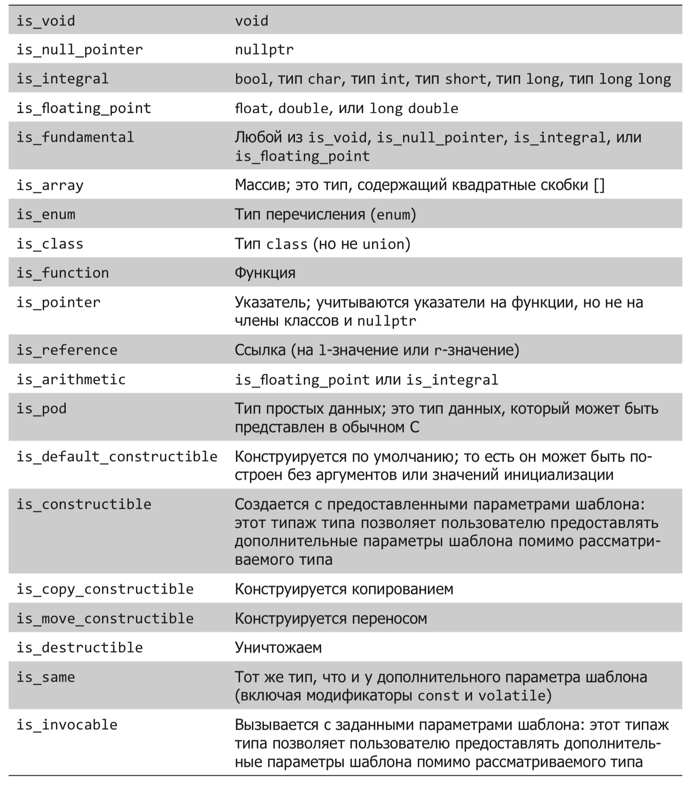

## Всякая всячина (1)

### Содержание

- [Константные if](#if-constexp)
- [Трейты типов](#Трейты-типов)
- [Pairs and Tuples](#Pairs-and-tuples)
- [Структурные связывания](#Структурные-связывания)
- [Ключевое слово mutable](#Ключевое-слово-mutable)
- [Разработка класса range](#Разработка-класса-range)
- [Автоматический вывод параметров шаблонов](#Автоматический-вывод-параметров-шаблонов)


### if constexp

Данное средство позволяет вычислять оператор **if** в процессе построения программы, что дает возможность организовать условную компиляцию (аналог препроцессора).

```cpp
template <typename T> 
auto get_value(T t)
{
   if constexpr (std::is_pointer_v<T>) 
     return *t;
   else
     return t;
}
```


### Трейты типов

**Трейты типов (характеристики типов)** - это шаблонный механизм, позволяющий анализировать типы.


```cpp
#include <iostream>
#include <type_traits>

class Class {};

int main() 
{
    std::cout << std::is_floating_point<Class>::value << '\n';  // 0
    std::cout << std::is_floating_point<float>::value << '\n';  // 1
    std::cout << std::is_floating_point<int>::value << '\n';    // 0
}
```

Проверки происходят во время построения программы.

Как устроены трейты?

В результате компиляции будут сгенерированы следующие структуры:

```cpp
struct is_floating_point_Class {
    static const bool value = false;
};

struct is_floating_point_float {
    static const bool value = true;
};

struct is_floating_point_int {
    static const bool value = false;
};
```
Обращения к ним во время выполнения приведут к печати нужных значений.

С помощью трейтов можно проверять параметры шаблонов, проводить условную компиляцию (без использования препроцессора)

```cpp
if constexpr(std::is_signed<T>::value)
        algorithm_signed(t);
else if constexpr (std::is_unsigned<T>::value)
        algorithm_unsigned(t);
```

Табличка полезных трейтов:



Более удобная запись трейтов типов появилась в стандарте **C++14**:

```cpp
std::is_pointer_v<T> // вместо std::is_pointer<T>::value
```

### Pairs and tuples

Пары и кортежи появились в С++ в разное время, но завоевали определенную известность.

Например, при работе с контейнером **map** используем пары:

```cpp
std::pair<std::string,std::string> key;
edMap.insert(make_pair(key,d));

// или так

std::pair<std::string,std::string> key;
edMap[key] = d;
```

При просмотре содержимого **map** пары очень полезны:

```cpp
for (auto it=mymap.begin(); it!=mymap.end(); ++it)
    std::cout << it->first << " => " << it->second << '\n';
```


Еще один пример использования **pair**, когда из функции необходимо вернуть 2 значения:

```cpp
template <typename T>
std::pair<bool, T> parse_string(const std::wstring &s)
{
    std::wistringstream iss(s);
    T t;
    bool success = !(iss >> t).fail();
    return std::make_pair(success, t);
}

auto r1 = parse_string<int>(L"123");
if (r1.first)
    cout << r.second;
else
    cout << "fail";
```

Теперь о кортежах.

Их также можно использовать для возвращения из функции набора значений:

```cpp
std::tuple<int, int, double> foo(int a, int b) {
  return std::make_tuple(a+b, a*b, double(a)/double(b));
}
```

Традиционный способ получения значения кортежа:

```cpp
t.get<n>();
// или
get<n>(t);
```

по номеру элемента **n**.

В стандарте С++17 появилось несколько упрощений при работе с кортежами.

Во-первых, стало проще их формировать:

```cpp
std::tuple<int, int, int, int> foo(int a, int b)    {
    return {a + b, a - b, a * b, a / b};
}
```

Во-вторых, появились **структурные связывания**, которые упрощают получение элементов:

```cpp
auto [add, sub, mul, div] = foo(5,12);
```

При работе с **lvalue** ссылками нужно использовать **std::tie**:

```cpp
std::tuple<int&, int&> minmax( int& a, int& b ) {
  if (b<a)
    return std::tie(b,a);
  else
    return std::tie(a,b);
}
```


### Структурные связывания

Связывания (bindings) уже упоминались выше. Теперь можно привести полезные примеры их использования

```cpp
std::map<std::string, int> m;
...
for (auto const& [key, value] : m) {
    std::cout << "The value for " << key << " is " << value << '\n';
}
```

Есть ограничения:

нельзя явно указывать типы элементов
нельзя использовать вложенные связывания

### Ключевое слово mutable

Когда мы пытаемся писать код, корректный с точки зрения использования понятия константности, то столкнёмся с тем, что семантическая неизменность не эквивалентна синтаксической неизменности. Другими словами, нам может понадобиться изменить состояние объекта (если этого требуют детали реализации), сохранив при этом видимое извне состояние объекта константным. 

Изменение внутреннего состояния может требоваться по каким-то глубоко техническим причинам и это не должно быть заметно для внешних клиентов нашего класса. Но выбор у нас не большой — если мы используем ключевое слово const при объявлении метода, то компилятор не позволит нам изменить объект этого класса, даже если эти изменения никто вне класса и не заметит.

см. пример (https://habr.com/ru/company/infopulse/blog/341264/)


```cpp
class Polygon {
  std::vector<Vertex> vertices;
  mutable double cachedArea{0};
  mutable std::mutex mutex;
public:
  //...

  double area() const {
    auto area = cachedArea;
    if (area == 0) {
      std::scoped_lock lock{mutex};
      area = geometry::calculateArea(vertices);
      cachedArea = area;
    }
    return area;
  }
```


Также ключевое слово mutable может быть применено ко всей лямбда-функции, что сделает все её переменные изменяемыми:

```cpp
int main() {
  int i = 2;
  auto ok = [i, x{22}]() mutable { i++; x+=i; };
}
```

### Разработка класса range

В качестве полезного класса можно рассмотреть **range** - диапазон.


```cpp
#include <iostream>

class num_iterator {
    int i;
public:

    explicit num_iterator(int position = 0) : i{position} {}

    int operator*() const { return i; }

    num_iterator& operator++() {
        ++i;
        return *this;
    }

    bool operator!=(const num_iterator &other) const {
        return i != other.i;
    }
};

class num_range {
    int a;
    int b;

public:
    num_range(int from, int to)
        : a{from}, b{to}
    {}

    num_iterator begin() const { return num_iterator{a}; }
    num_iterator end()   const { return num_iterator{b}; }
};

int main()
{
    num_range r {100, 110};

    for (int i : r) {
        std::cout << i << ", ";
    }
    std::cout << '\n';
    return 0;
}
```

### Автоматический вывод параметров шаблонов

Вместо

`std::lock_guard<std::mutex> guard(mutex);` 

можно будет писать

`std::lock_guard guard(mutex);`

При инстанцировании шаблонов классов можно будет не указывать тип, так же как и при инстанцировании шаблонов функций.

### Обзоры строк (string_view)

Совершенно безопасно использовать **std::string_view** как параметр функции, если функции нужно не владение, а обзор строки, и не требуется сохранять обзор для последующего использования в другом месте.

Класс **string_view** хорош тем, что он легко конструируется и из **std::string** и из `const char*` без дополнительного выделения памяти. А ещё он имеет поддержку `constexpr` и повторяет интерфейс **std::string**. Но есть минус: для **string_view** не гарантируется наличие нулевого символа на конце.

```cpp
#include <iostream>
#include <string_view>
 
int main()
{
  std::string_view text{ "hello" }; // представление для строки "hello", которое хранится в бинарном виде
  std::string_view str{ text }; // представление этой же строки - "hello"
  std::string_view more{ str }; // представление этой же строки - "hello"
 
  std::cout << text << ' ' << str << ' ' << more << '\n';
 
  return 0;
}
```


